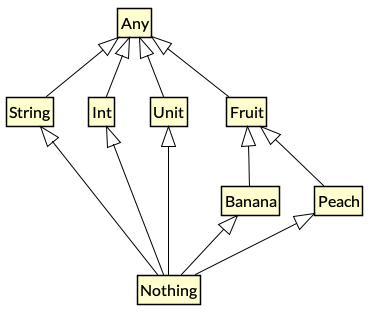

---

theme : "night"
transition: "slide"
highlightTheme: "monokai"
slideNumber: true
title: "Kotlin FP with Arrow"

---

### 2. Domain Modeling
### with ADT

<style>
pre {
  background: #303030;
  padding: 10px 16px;
  border-radius: 0.3em;
  counter-reset: line;
}
pre code[class*="="] .line {
  display: block;
  line-height: 1.8rem;
  font-size: 1em;
}
pre code[class*="="] .line:before {
  counter-increment: line;
  content: counter(line);
  display: inline-block;
  border-right: 3px solid #6ce26c !important;
  padding: 0 .5em;
  margin-right: .5em;
  color: #afafaf !important;
  width: 24px;
  text-align: right;
}

.reveal .slides > section > section {
  text-align: center; 
}

h1,h2,h3,h4 {
  text-align: center;
}

p {
  text-align: center;
}
</style>

--

[return to Outline](../../export/#/2)

--

### References

- http://www.natpryce.com/articles/000818.html
- https://agrawalsuneet.github.io/blogs/difference-between-any-unit-and-nothing-kotlin/

---

### Kotlin Type Hierarchy



--

- Top Type - `Any`
- Bottom Type - `Nothing`
- `Unit`

---

### Any

<font size="6">The root of the Kotlin class hierarchy. 

➡️ Every Kotlin class has `Any` as a superclass.</font>

--

```kotlin=
fun main() {
  val num: Int = 5
  val anyVal: Any = num
  
  println("$anyVal") // 5
  println("${num.plus(10)}") // 15
  println("${anyVal.plus(10)}") // Error: Unresolved reference
}
```

--

`Any` is *similar* to the `Object` class in Java

➡️ `Any` only has 3 functions

```kotlin=
fun main() {
  val anyVal: Any = Any()
  val anyVal2: Any = Any()
  val objVal: Object = Object()

  println("${anyVal::class}") // class java.lang.Object
  println("${objVal::class}") // class java.lang.Object
    
  println("${anyVal.equals(anyVal2)}")  // false
  println("${anyVal == anyVal2}")       // false
  // A.equals(B) is the same as (A == B) if A is a non-null type
  
  println("${anyVal.hashCode()}") // 87285178
  
  println("${anyVal.toString()}") // java.lang.Object@533ddba
  println("$anyVal")              // java.lang.Object@533ddba  
}
```

---

### Nothing

<font size="6">`Nothing` is used to represent a value which will *never exist*.</font>

--

What kinds of expression evaluate to `Nothing`?

- ➡️ Those that perform control flow.
- ➡️ `throw` an exception
- ➡️ To represent the *absurd scenarios*.

--

```kotlin=
public inline fun TODO(): Nothing = throw NotImplementedError()

fun doOps(op: String): String = when (op) {
  "sum" -> "Sum up the values..."
  "square" -> TODO() // Note the type inference is not broken
  else -> "Do nothing."
}

fun main() {
  val result: String = doOps("square") // kotlin.NotImplementedError: An operation is not implemented.
  println("$result") // unreachable code
}
```

---

### Unit

<font size="6">The type with only one value: the `Unit` object.

🔍 This type corresponds to the `void` type in Java.</font>

--

Use `Unit` as return type of a function

- ➡️ Indicate a *Side Effect* !
- ➡️ The input must be *consumed* in the function

--

```kotlin=
import java.io.FileNotFoundException

fun printException(e: Exception): Unit = when (e) {
  is IllegalArgumentException -> println("The input is invalid: $e")
  is FileNotFoundException -> println("Cannot find the file: $e")
  else -> println("Other exception: $e")
}

fun main() {
  val e = IllegalArgumentException()
  printException(e) // Side Effect => the input "e" is consumed
}
```

---

### Why Type System

- Leverage compiler
  - ➡️ Type inference, Type check, ...
  - ➡️ Validation
- Code Readability
- One of the FP goals is to *bring certainty to the compiler with the types*
  - Pattern Matching
  - Domain Modeling

---

### Type Safety

--

Let us see a bad case first ...

```kotlin=
import java.time.LocalDate

data class File(
    val fileName: String,
    val title: String,
    val content: String,
    val author: String,
    val updateDate: LocalDate
)

fun main() {
    val strangeFile = File(
        "Functional Programming Note", // should be `fileName`
        "Jack", // should be `title`
        "This is a note for learning FP.", // `content`, the only correct String field
        "FP_note.txt", // should be `author`
        LocalDate.now()
    )
    
    println("$strangeFile")
    // File(fileName=Functional Programming Note, title=Jack, content=This is a note for learning FP., author=FP_note.txt, updateDate=2021-10-05)
}
```

--

### Inline Class

```kotlin=
@JvmInline value class FileName(private val value: String)
@JvmInline value class Title(private val value: String)
@JvmInline value class Content(private val value: String)
@JvmInline value class Author(private val value: String)

data class File(
    val fileName: FileName,
    val title: Title,
    val content: Content,
    val author: Author,
    val updateDate: LocalDate
)
```

--

https://kotlinlang.org/docs/inline-classes.html

```kotlin=
// Deprecated in Kotlin 1.5 to prevent confusing with `inline function`.
// inline class FileName(val value: String)

@JvmInline 
value class FileName(private val value: String)
```

--

### Why Inline Class

- Type-safe Domain Modeling
- No runtime overhead

🔍 <font size="6">At runtime, instances of the inline class will be represented using this single property</font>

```kotlin=
// No actual instantiation of class `FileName` happens
// At runtime `fileName` contains just `String`

val fileName = FileName("FP_note.txt")
// val fileName = "FP_note.txt"
```

--

➡️ Type-safe Domain Modeling

```kotlin=
import java.time.LocalDate

@JvmInline value class FileName(private val value: String)
@JvmInline value class Title(private val value: String)
@JvmInline value class Content(private val value: String)
@JvmInline value class Author(private val value: String)

data class File(
    val fileName: FileName,
    val title: Title,
    val content: Content,
    val author: Author,
    val updateDate: LocalDate
)

fun main() {
    val myNote = File(
        FileName("FP_note.txt"),
        Title("Functional Programming Note"),
        Content("This is a note for learning FP."),
        Author("Jack"),
        LocalDate.now()
    )
       
    println("$myNote")
    // File(fileName=FileName(value=FP_note.txt), title=Title(value=Functional Programming Note), content=Content(value=This is a note for learning FP.), author=Author(value=Jack), updateDate=2021-10-05)
}
```

---

### Type Alias

➡️ Just an alias, not for type safety

🔍 Type aliases provide *alternative names* for existing types.

--

The `strangeFile` is still wrong and not type-safe.

```kotlin=
import java.time.LocalDate

typealias FileName = String
typealias Title = String
typealias Content = String
typealias Author = String

data class File(
    val fileName: FileName,
    val title: Title,
    val content: Content,
    val author: Author,
    val updateDate: LocalDate
)

fun main() {
    val strangeFile = File(
        "Functional Programming Note", // should be `fileName`
        "Jack", // should be `title`
        "This is a note for learning FP.", // `content`, the only correct String field
        "FP_note.txt", // should be `author`
        LocalDate.now()
    )
       
    println("$strangeFile")
}
```

--

### When to use Type Alias

https://kotlinlang.org/docs/type-aliases.html

<font size="6"> ➡️ It's useful to shorten long generic types and function types. </font>

```kotlin=
typealias FileTable<K> = MutableMap<K, MutableList<File>>

typealias MyHandler = (Int, String, Any) -> Unit
```

---

### Algebraic Data Type (ADT)

<font size="6"> 🔍 a kind of *Composite Type*

i.e., a type formed by combining other types. </font>

- Product Type ➡️ `data class`
- Sum Type ➡️ `enum`, `sealed class`

---

### Product Type

🔍 should have *all* the composed types

A & B & C ➡️ A * B * C

--

### Data Class

https://kotlinlang.org/docs/data-classes.html

```kotlin=
import java.time.LocalDate

@JvmInline value class FileName(private val value: String)

data class File(
    val fileName: FileName,
    val updateDate: LocalDate
)

fun main() {
    val fpNote = File(FileName("FP_note.txt"), LocalDate.now())
    val kotlinNote = File(FileName("kotlin_note.txt"), LocalDate.now())
    
    // File.toString()
    println("$fpNote") // File(fileName=FileName(value=FP_note.txt), updateDate=2021-10-05)
    
    // File.equals()
    println(fpNote == kotlinNote) // false
    println(fpNote == File(FileName("FP_note.txt"), LocalDate.now())) // true
    
    // File.copy()
    println("${fpNote.copy(fileName = FileName("another_note.txt"))}") // File(fileName=FileName(value=another_note.txt), updateDate=2021-10-05)
}
```

---

### Sum Type

🔍 should have *one of* the composed types

A | B | C ➡️ A + B + C

--

### Enum Class

https://kotlinlang.org/docs/enum-classes.html

```kotlin=
enum class Direction {
    NORTH, SOUTH, WEST, EAST
}

fun main() {
    val north = Direction.NORTH
    val south = Direction.SOUTH
    
    println("${north.ordinal}, $north") // 0, NORTH
    println("${south.ordinal}, $south") // 1, SOUTH
}
```

--

### Sealed Class

https://kotlinlang.org/docs/sealed-classes.html

```kotlin=
class File() { /* Generate a File object */ }
class DataSource() { /* Connect to DB */ }

sealed class MyError {
    data class FileReadError(val f: File): MyError()
    data class DatabaseError(val source: DataSource): MyError()
    object RuntimeError: MyError()
}

fun readFile(f: File, source: DataSource) = MyError.FileReadError(f)

fun log(e: MyError) = when(e) {
    is MyError.FileReadError -> println("File not found: $e")
    is MyError.DatabaseError -> println("DB connection error: $e")
    is MyError.RuntimeError -> println("$e")
    // Note that we don't need the `else` part because `MyError` is a `sealed class`
}

fun main() {
    val e = readFile(File(), DataSource())
    log(e) // File not found: FileReadError(f=File@2c7b84de)
}
```

--

Can we avoid to use `Phone?` and `MailAddress?`

```kotlin=
@JvmInline value class FileName(private val value: String)
@JvmInline value class Title(private val value: String)
@JvmInline value class Content(private val value: String)
@JvmInline value class Author(private val value: String)
@JvmInline value class Phone(private val value: String)
@JvmInline value class MailAddress(private val value: String)

data class File(
    val fileName: FileName,
    val title: Title,
    val content: Content,
    val author: Author,
    val updateDate: LocalDate,
    val phone: Phone?,
    val mailAddress: MailAddress?
)
```

--

Refactor with `sealed class`

```kotlin=
data class File(
    val fileName: FileName,
    val title: Title,
    val content: Content,
    val author: Author,
    val updateDate: LocalDate,
    val contact: Contact
)

sealed class Contact {
    data class WithPhone(val phone: Phone): Contact()
    data class WithMail(val mailAddress: MailAddress): Contact()
}
```

--

<font size="6"> ➡️ Compiler can now enforce exhaustive evaluation </font>

```kotlin=
import java.time.LocalDate

@JvmInline value class FileName(private val value: String)
@JvmInline value class Title(private val value: String)
@JvmInline value class Content(private val value: String)
@JvmInline value class Author(private val value: String)
@JvmInline value class Phone(private val value: String)
@JvmInline value class MailAddress(private val value: String)

data class File(
    val fileName: FileName,
    val title: Title,
    val content: Content,
    val author: Author,
    val updateDate: LocalDate,
    val contact: Contact
)

sealed class Contact {
    data class WithPhone(val phone: Phone): Contact()
    data class WithMail(val mailAddress: MailAddress): Contact()
}

fun main() {
    val myNote = File(
        FileName("FP_note.txt"),
        Title("Functional Programming Note"),
        Content("This is a note for learning FP."),
        Author("Jack"),
        LocalDate.now(),
        Contact.WithPhone(Phone("88612345"))
    )
    println("$myNote")
    // File(fileName=FileName(value=FP_note.txt), title=Title(value=Functional Programming Note), content=Content(value=This is a note for learning FP.), author=Author(value=Jack), updateDate=2021-10-05, contact=WithPhone(phone=Phone(value=88612345)))
    
    when(myNote.contact) {
        is Contact.WithPhone -> println("Contact phone number: ${myNote.contact}")
        is Contact.WithMail -> println("Contact mail address: ${myNote.contact}")
    }
    // Contact phone number: WithPhone(phone=Phone(value=88612345))
}
```

---

### Recap #1

- Top Type: `Any`
    - <font size="5">The root of the Kotlin class hierarchy. Every Kotlin class has `Any` as a superclass.</font>
- Bottom Type: `Nothing`
    - <font size="5">`Nothing` is used to represent a value which will never exist.</font>
    - <font size="5">Functions throwing exception directly</font>
- `Unit`
    - <font size="5">`Unit` is exactly equivalent to the `void` type in Java.</font>
    - <font size="5">Functions that return `Unit` can indicate a *side effect* inside.</font>

--

### Recap #2

- *Type Safety* and Readability
- Inline Class
- Type Alias
- Algebraic Data Type (ADT)
- Product Type: `data class`
- Sum Type: `enum class`, `sealed class`