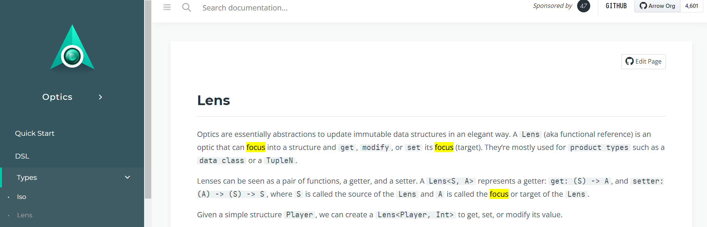
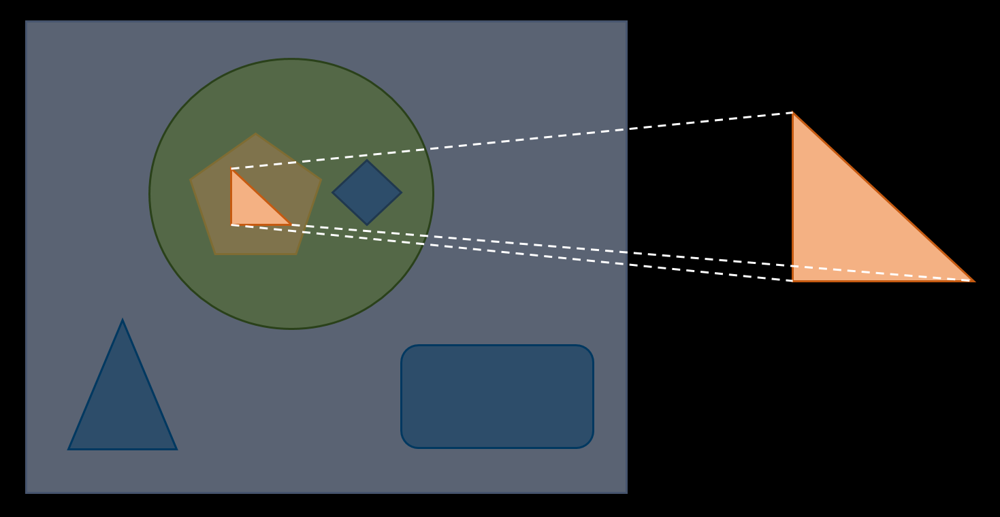

---

theme : "night"
transition: "slide"
highlightTheme: "monokai"
slideNumber: true
title: "Kotlin FP with Arrow"

---

#### ch 3.
### Immutable Data Operation
### with Optics

<style>
pre {
  background: #303030;
  padding: 10px 16px;
  border-radius: 0.3em;
  counter-reset: line;
}
pre code[class*="="] .line {
  display: block;
  line-height: 1.8rem;
  font-size: 1em;
}
pre code[class*="="] .line:before {
  counter-increment: line;
  content: counter(line);
  display: inline-block;
  border-right: 3px solid #6ce26c !important;
  padding: 0 .5em;
  margin-right: .5em;
  color: #afafaf !important;
  width: 24px;
  text-align: right;
}

.reveal .slides > section > section {
  text-align: center; 
}

h1,h2,h3,h4 {
  text-align: center;
}

p {
  text-align: center;
}
</style>

--

[return to Outline](../../export/#/2)

--

### References

- https://ivanmorgillo.com/2020/11/19/doh-there-is-no-copy-method-for-sealed-classes-in-kotlin/

---

### Immutability 

- Deterministic ➡️ same input, same output
- Pure Function ➡️ work over *immutable data*
- Easier to **test**
- Easier to **trace**
- Thread safety

---

### Data Class

`copy`

```kotlin=
data class Employee(val name: String, val id: String)

fun main() {
    val employeeJack = Employee(name = "Jack", id = "1")
    val employeeAnotherJack = employeeJack.copy(id = "2") // return a new instance instead of modifying it

    println("$employeeJack")  // Employee(name=Jack, id=1)
    println("$employeeAnotherJack")  // Employee(name=Jack, id=2)
}
```

--

### Nested Data Class

Deep `copy`

```kotlin=
data class Street(val number: Int, val name: String)
data class Address(val city: String, val street: Street)
data class Company(val name: String, val address: Address)
data class Employee(val name: String, val company: Company)

fun Employee.updateStreetName(newStreetName: String): Employee =
    this.copy(
        company = this.company.copy(
            address = this.company.address.copy(
                street = this.company.address.street.copy(
                    name = newStreetName
                )
            )
        )
    )

fun main() {
    val john = Employee("John Doe", Company("Arrow", Address("Functional city", Street(23, "lambda street"))))
    val johnInAlphaStreet = john.updateStreetName("alpha street")
    println("$johnInAlphaStreet")
    // Employee(name=John Doe, company=Company(name=Arrow, address=Address(city=Functional city, street=Street(number=23, name=alpha street))))
}
```

--

### 🔍 with Optics

```kotlin=
import arrow.optics.optics

@optics data class Street(val number: Int, val name: String) { companion object }
@optics data class Address(val city: String, val street: Street) { companion object }
@optics data class Company(val name: String, val address: Address) { companion object }
@optics data class Employee(val name: String, val company: Company) { companion object }

fun Employee.updateStreetName(newStreetName: String): Employee =
    Employee.company.address.street.name.set(this, newStreetName)

fun main() {
    val john = Employee("John Doe", Company("Arrow", Address("Functional city", Street(23, "lambda street"))))
    val johnInAlphaStreet = john.updateStreetName("alpha street")
    println("$johnInAlphaStreet")
    // Employee(name=John Doe, company=Company(name=Arrow, address=Address(city=Functional city, street=Street(number=23, name=alpha street))))
}
```

--

### Copy Sealed Class

- There is NO `copy` method for `sealed class`

```kotlin=
sealed class ContactInformation {
    data class Email(val value: String) : ContactInformation()
    data class HomeAddress(val street: String) : ContactInformation()
    object Pigeon : ContactInformation()
    sealed class Phone : ContactInformation() {
        data class MobilePhone(val number: String) : Phone()
        data class OfficePhone(val number: String) : Phone()
        data class HomePhone(val number: String) : Phone()
    }
}

data class UserProfile(val name: String, val contact: ContactInformation)

fun main() {
    val joe = UserProfile(name = "Joe", contact = ContactInformation.Phone.MobilePhone("123456789"))
    val joeWithNewPhone = joe.copy(contact = joe.contact.copy(ContactInformation.Phone.MobilePhone("987654321")))
    // Unresolved reference: copy
}
```

--

...or need to do something horrible 

```kotlin=
fun main() {
    val joe = UserProfile(name = "Joe", contact = ContactInformation.Phone.MobilePhone("123456789"))

    val newPhone = when (joe.contact) {
        is ContactInformation.Email -> joe.contact
        is ContactInformation.Phone.MobilePhone -> ContactInformation.Phone.MobilePhone("987654321")
        is ContactInformation.Phone.OfficePhone -> ContactInformation.Phone.MobilePhone("987654321")
        is ContactInformation.Phone.HomePhone -> ContactInformation.Phone.MobilePhone("987654321")
        is ContactInformation.HomeAddress -> joe.contact
        is ContactInformation.Pigeon -> joe.contact
    }
    val joeWithNewPhone = joe.copy(contact = newPhone)
    println(joeWithNewPhone) // UserProfile(name=Joe, contact=MobilePhone(number=987654321))
}
```

--

### 🔍 with Optics

```kotlin=
import arrow.optics.optics

@optics
sealed class ContactInformation {
    companion object {}

    data class Email(val value: String) : ContactInformation()
    data class HomeAddress(val street: String) : ContactInformation()
    object Pigeon : ContactInformation()

    @optics
    sealed class Phone : ContactInformation() {
        companion object {}

        @optics data class MobilePhone(val number: String) : Phone() { companion object }
        @optics data class OfficePhone(val number: String) : Phone() { companion object }
        @optics data class HomePhone(val number: String) : Phone() { companion object }
    }
}

@optics
data class UserProfile(val name: String, val contact: ContactInformation) { companion object }

fun main() {
    val joe = UserProfile(name = "Joe", contact = ContactInformation.Phone.MobilePhone("123456789"))
    val joeWithNewPhone = UserProfile.contact.set(joe, ContactInformation.Phone.MobilePhone("987654321"))
    println(joeWithNewPhone) // UserProfile(name=Joe, contact=MobilePhone(number=987654321))
}
```

---

### Optics

- provided by [Arrow-kt](https://arrow-kt.io/docs/optics/)
- DSL (Domain-Specific Language)
	- ➡️ improve *ease of use* and *readability*
- **Generated at compile time**
- Direct and reusable syntax to read / modify immutable data structures
	- ➡️ "modify" means copy and *return a new instance*

--

### Arrow Optics

https://arrow-kt.io/docs/optics/


--

🔍 `Focus` means the target object


--

### Optics

- Lens
- Prism
- Optional
- Traversal
- Every
- Iso

---

### Lens

- Functional reference
- Focus into a structure and operate its focus
	- `get` ➡️ get the focus
	- `set` ➡️ set the focus to input value
	- `modify` ➡️ update the focus with input function

--

```kotlin=
import arrow.optics.Lens

data class UserProfile(val name: String)

val userProfileLens: Lens<UserProfile, String> = Lens(
    get = { userProfile -> userProfile.name },
    set = { userProfile, value -> userProfile.copy(name = value) }
)

fun main() {
    val joe = UserProfile("Joe")

    println(userProfileLens.get(joe)) // Joe
    println(userProfileLens.set(joe, "Jack")) // UserProfile(name=Jack)
    println(userProfileLens.modify(joe) { it.lowercase() }) // UserProfile(name=joe)
}
```
	
--

### Prism

- See into a structure and optionally find its focus
	- `getOrModify` ➡️ match the focus 
	- `reverseGet` ➡️ get back to the source domain from the focus
- Mostly used for structures that have a relationship only under a *certain condition*
	- ➡️ Copy method for `sealed class` !

--

```kotlin=
import arrow.core.left
import arrow.core.right
import arrow.optics.Prism

sealed class ContactInformation {
    data class Email(val value: String) : ContactInformation()
    object Pigeon : ContactInformation()
}

val contactInformationPrism: Prism<ContactInformation, ContactInformation.Email> = Prism(
    getOrModify = { contactInformation ->
        when (contactInformation) {
            is ContactInformation.Email -> contactInformation.right()
            else -> contactInformation.left()
        }
    },
    reverseGet = { contactInformation -> contactInformation } // (::identity)
)

fun main() {
    val contactInformation = ContactInformation.Email("joe@mail.com")

    val newContactInformation = contactInformationPrism.modify(contactInformation) { email ->
        email.copy(value = "newJoe@mail.com")
    }
    println(newContactInformation) // Email(value=newJoe@mail.com)

    println(contactInformationPrism.getOrModify(ContactInformation.Pigeon)) // Either.Left(playground.ContactInformation$Pigeon@6537cf78)
    println(contactInformationPrism.getOrModify(ContactInformation.Email("jack@mail.com"))) // Either.Right(Email(value=jack@mail.com))
    println(contactInformationPrism.reverseGet(ContactInformation.Email("joe@mail.com"))) // Email(value=joe@mail.com)
}

```	

--

How does `reverseGet` work ?

```kotlin=
import arrow.core.compose
import arrow.core.left
import arrow.core.right
import arrow.optics.Prism

sealed class ContactInformation {
    data class Email(val value: String) : ContactInformation()
    object Pigeon : ContactInformation()
}

fun ContactInformation.Email.upperEmail(): String = this.value.uppercase()

val contactInformationPrism: Prism<ContactInformation, ContactInformation.Email> = Prism(
    getOrModify = { contactInformation ->
        when (contactInformation) {
            is ContactInformation.Email -> contactInformation.right()
            else -> contactInformation.left()
        }
    },
    reverseGet = ContactInformation::Email compose ContactInformation.Email::upperEmail // (Email) -> (String) -> Email
)

fun main() {
    val contactInformation = ContactInformation.Email("joe@mail.com")

    val newContactInformation = contactInformationPrism.modify(contactInformation) { email ->
        email.copy(value = "newJoe@mail.com")
    }
    println(newContactInformation) // Email(value=NEWJOE@MAIL.COM)
    // Note the email value is uppercase!
    // 1. modify(source: S, map: (A) -> B): T
    // 2. reverseGet(focus: B): T
    // chain 1. and 2., we get (A) -> (B) -> T, that's why the email value is uppercase

    println(contactInformationPrism.getOrModify(ContactInformation.Pigeon)) // Either.Left(playground.ContactInformation$Pigeon@b97c004)
    println(contactInformationPrism.getOrModify(ContactInformation.Email("jack@mail.com"))) // Either.Right(Email(value=jack@mail.com))
    println(contactInformationPrism.reverseGet(ContactInformation.Email("joe@mail.com"))) // Email(value=JOE@MAIL.COM)
}
```
	
--

### Optional

- Allow seeing into a structure and *getting, setting, or modifying an optional focus*
	- Lens ➡️ getting, setting, or modifying
	- Prism ➡️ an optional focus

--

🔍 `Optional` is composed of `Lens` and `Prism`

```kotlin=
//    val emailUpdated = when(contactInformation) {
//        is ContactInformation.Email -> contactInformation.copy(value = "jack@mail.com")
//        else -> contactInformation
//    }

    val emailOptional: Optional<ContactInformation, String> =
        ContactInformation.email compose ContactInformation.Email.value

    val emailOptional2: Optional<ContactInformation, String> =
        ContactInformation.email.value
```	
	
--

```kotlin=
import arrow.optics.Optional
import arrow.optics.optics

@optics
sealed class ContactInformation {
    companion object {}

    @optics data class Email(val value: String) : ContactInformation() { companion object }
    object Pigeon : ContactInformation()
}

fun main() {
    val contactInformation = ContactInformation.Email("joe@mail.com")

    val emailUpdated = when(contactInformation) {
        is ContactInformation.Email -> contactInformation.copy(value = "jack@mail.com")
        else -> contactInformation
    }

    val emailOptional: Optional<ContactInformation, String> =
        ContactInformation.email compose ContactInformation.Email.value

    val emailOptional2: Optional<ContactInformation, String> =
        ContactInformation.email.value

    println(emailUpdated) // Email(value=jack@mail.com)

    println(emailOptional.set(contactInformation, "jack@mail.com")) // Email(value=jack@mail.com)
    println(emailOptional.getOrModify(ContactInformation.Pigeon)) // Either.Left(playground.ContactInformation$Pigeon@5ae9a829)
    println(emailOptional.getOrModify(ContactInformation.Email("jack@mail.com"))) // Either.Right(jack@mail.com)

    println(emailOptional2.set(contactInformation, "jack@mail.com")) // Email(value=jack@mail.com)
    println(emailOptional2.getOrModify(ContactInformation.Pigeon)) // Either.Left(playground.ContactInformation$Pigeon@5ae9a829)
    println(emailOptional2.getOrModify(ContactInformation.Email("jack@mail.com"))) // Either.Right(jack@mail.com)
}
```	
	
---

### Traversal

- See into a structure and set, or modify 0 to N foci
- Focus into a structure that has 0 to N elements
	- such as *collections* etc.

--

```kotlin=
import arrow.optics.Traversal

fun main() {
    val users = listOf("Joe", "Jack", "Mark", "Sam")
    val traversalString = Traversal.list<String>()

    val upperUsers = traversalString.modify(users) { it.uppercase() }
    println(upperUsers) // [JOE, JACK, MARK, SAM]
}
```

--

Composed by `Lens`

```kotlin=
import arrow.optics.Traversal
import arrow.optics.optics

@optics data class Street(val number: Int, val name: String) { companion object }
@optics data class Address(val city: String, val street: Street) { companion object }
@optics data class Company(val name: String, val address: Address) { companion object }
@optics data class Employee(val name: String, val company: Company) { companion object }
@optics data class Employees(val employees: List<Employee>) { companion object }


fun main() {
    val employees = Employees(
        listOf(
            Employee("John", Company("Arrow", Address("Functional city", Street(23, "lambda street")))),
            Employee("Jane", Company("Arrow", Address("Functional city", Street(23, "lambda street")))),
            Employee("Mark", Company("Arrow", Address("Functional city", Street(23, "lambda street")))),
            Employee("Sam", Company("Arrow", Address("Functional city", Street(23, "lambda street"))))
        )
    )

    val employeeStreetName =
        Employees.employees compose // (Employees) -> List<Employee>
           Traversal.list() compose // (List<Employee>) -> Employee
           Employee.company compose // (Employee) -> Company
            Company.address compose // (Company) -> Address
             Address.street compose // (Address) -> Street
                Street.name         // (Street) -> String

    println(employeeStreetName.set(employees, "alpha street"))
    // Employees(employees=[
    //  Employee(name=John, company=Company(name=Arrow, address=Address(city=Functional city, street=Street(number=23, name=alpha street)))), 
    //  Employee(name=Jane, company=Company(name=Arrow, address=Address(city=Functional city, street=Street(number=23, name=alpha street)))), 
    //  Employee(name=Mark, company=Company(name=Arrow, address=Address(city=Functional city, street=Street(number=23, name=alpha street)))), 
    //  Employee(name=Sam, company=Company(name=Arrow, address=Address(city=Functional city, street=Street(number=23, name=alpha street))))
    // ])
}
```

--

### Every

- See into a structure and set, or modify 0 to N foci
- Focus into a structure that has 0 to N elements
	- such as *collections* etc.
- **Match over elements** on a collection

--

Composed by `Lens` and `Prism`

```kotlin=
import arrow.optics.Every
import arrow.optics.optics

@optics
sealed class ContactInformation {
    companion object {}

    @optics data class Email(val value: String) : ContactInformation() { companion object }
    @optics data class HomeAddress(val street: String) : ContactInformation() { companion object }
    object Pigeon : ContactInformation()

    @optics
    sealed class Phone : ContactInformation() {
        companion object {}

        @optics data class MobilePhone(val number: String) : Phone() { companion object }
        @optics data class OfficePhone(val number: String) : Phone() { companion object }
        @optics data class HomePhone(val number: String) : Phone() { companion object }
    }
}

@optics data class UserProfile(val name: String, val contact: ContactInformation) { companion object }
@optics data class UserProfiles(val userProfiles: List<UserProfile>) { companion object }

fun main() {
    val userProfiles = UserProfiles(
        listOf(
            UserProfile(name = "Joe", contact = ContactInformation.Email(value = "joe@mail.com")),
            UserProfile(name = "Jack", contact = ContactInformation.Pigeon),
            UserProfile(name = "Mark", contact = ContactInformation.HomeAddress(street = "lambda street")),
            UserProfile(name = "Sam", contact = ContactInformation.Phone.MobilePhone(number = "123456789"))
        )
    )

    val userMobilePhoneNumber = UserProfiles.userProfiles compose // (UserProfiles) ->  List<UserProfile>
                                       Every.list() compose // (List<UserProfile>) -> UserProfile
                                UserProfile.contact compose // (UserProfile) -> ContactInformation
                           ContactInformation.phone compose // (ContactInformation) -> Phone
               ContactInformation.Phone.mobilePhone compose // (Phone) -> MobilePhone
        ContactInformation.Phone.MobilePhone.number         // (MobilePhone) -> String

    println(userMobilePhoneNumber.set(userProfiles, "987654321"))
    // UserProfiles(userProfiles=[
    //  UserProfile(name=Joe, contact=Email(value=joe@mail.com)), 
    //  UserProfile(name=Jack, contact=playground.ContactInformation$Pigeon@4c70fda8), 
    //  UserProfile(name=Mark, contact=HomeAddress(street=lambda street)), 
    //  UserProfile(name=Sam, contact=MobilePhone(number=987654321))
    // ])
}
```

--

🔍 Leverage DSL

```kotlin=
import arrow.optics.Every
import arrow.optics.dsl.every
import arrow.optics.optics

@optics
sealed class ContactInformation {
    companion object {}

    @optics data class Email(val value: String) : ContactInformation() { companion object }
    @optics data class HomeAddress(val street: String) : ContactInformation() { companion object }
    object Pigeon : ContactInformation()

    @optics
    sealed class Phone : ContactInformation() {
        companion object {}

        @optics data class MobilePhone(val number: String) : Phone() { companion object }
        @optics data class OfficePhone(val number: String) : Phone() { companion object }
        @optics data class HomePhone(val number: String) : Phone() { companion object }
    }
}

@optics data class UserProfile(val name: String, val contact: ContactInformation) { companion object }
@optics data class UserProfiles(val userProfiles: List<UserProfile>) { companion object }

fun main() {
    val userProfiles = UserProfiles(
        listOf(
            UserProfile(name = "Joe", contact = ContactInformation.Email(value = "joe@mail.com")),
            UserProfile(name = "Jack", contact = ContactInformation.Pigeon),
            UserProfile(name = "Mark", contact = ContactInformation.HomeAddress(street = "lambda street")),
            UserProfile(name = "Sam", contact = ContactInformation.Phone.MobilePhone(number = "123456789"))
        )
    )

    // Leverage Every DSL
    val userMobilePhoneNumber = UserProfiles.userProfiles.every(Every.list()).contact.phone.mobilePhone.number

    println(userMobilePhoneNumber.set(userProfiles, "987654321"))
    // UserProfiles(userProfiles=[
    //  UserProfile(name=Joe, contact=Email(value=joe@mail.com)),
    //  UserProfile(name=Jack, contact=playground.ContactInformation$Pigeon@4c70fda8),
    //  UserProfile(name=Mark, contact=HomeAddress(street=lambda street)),
    //  UserProfile(name=Sam, contact=MobilePhone(number=987654321))
    // ])
}
```

---

### Iso

- Define an **isomorphism** between a type `S` and `A`
	- `data class` and `Pair` / `Triple` / `TupleN`
- **Invertible** optic

--

```kotlin=
import arrow.optics.Iso

data class User(val name: String, val id: String)

fun main() {
    val userIsoPair: Iso<User, Pair<String, String>> = Iso(
        get = { user -> user.name to user.id },
        reverseGet = { (a, b) -> User(a, b) }
    )

    val user = User("Joe", "111")
    println(user) // User(name=Joe, id=111)
    val pairUser = userIsoPair.get(user)
    println(pairUser) // (Joe, 111)
    val reversePairUser = userIsoPair.reverseGet(pairUser)
    println(reversePairUser) // User(name=Joe, id=111)
}
```

--

Generated by `@optics`

```kotlin=
import arrow.optics.optics

@optics data class User(val name: String, val id: String) { companion object }

fun main() {
    val user = User("Joe", "111")
    println(user) // User(name=Joe, id=111)
    val pairUser = User.iso.get(user)
    println(pairUser) // (Joe, 111)
    val reversePairUser = User.iso.reverseGet(pairUser)
    println(reversePairUser) // User(name=Joe, id=111)
}
```

--

🔍 Compose with other optics
```kotlin=
import arrow.optics.Every
import arrow.optics.dsl.every
import arrow.optics.optics

@optics
sealed class ContactInformation {
    companion object {}

    @optics data class Email(val value: String) : ContactInformation() { companion object }
    @optics data class HomeAddress(val street: String) : ContactInformation() { companion object }
    object Pigeon : ContactInformation()

    @optics
    sealed class Phone : ContactInformation() {
        companion object {}

        @optics data class MobilePhone(val model: String, val number: String) : Phone() { companion object }
        @optics data class OfficePhone(val model: String, val number: String) : Phone() { companion object }
        @optics data class HomePhone(val model: String, val number: String) : Phone() { companion object }
    }
}

@optics data class UserProfile(val name: String, val contact: ContactInformation) { companion object }
@optics data class UserProfiles(val userProfiles: List<UserProfile>) { companion object }

fun main() {
    val userProfiles = UserProfiles(
        listOf(
            UserProfile(name = "Joe", contact = ContactInformation.Email(value = "joe@mail.com")),
            UserProfile(name = "Jack", contact = ContactInformation.Pigeon),
            UserProfile(name = "Mark", contact = ContactInformation.HomeAddress(street = "lambda street")),
            UserProfile(name = "Sam", contact = ContactInformation.Phone.MobilePhone(model = "Pixel5", number = "123456789")),
            UserProfile(name = "Tim", contact = ContactInformation.Phone.OfficePhone(model = "SE125", number = "112379")),
            UserProfile(name = "Hank", contact = ContactInformation.Phone.HomePhone(model = "XA950", number = "56431978"))
        )
    )

    val userMobilePhone = UserProfiles.userProfiles
        .every(Every.list())
        .contact
        .phone
        .mobilePhone
        .compose(ContactInformation.Phone.MobilePhone.iso)

    println(userMobilePhone.getAll(userProfiles))
    // [(Pixel5, 123456789)]
    println(userMobilePhone.set(userProfiles, Pair("Sony Xperia", "123456789")))
    // UserProfiles(userProfiles=[
    //  UserProfile(name=Joe, contact=Email(value=joe@mail.com)), 
    //  UserProfile(name=Jack, contact=playground.ContactInformation$Pigeon@57fffcd7),
    //  UserProfile(name=Mark, contact=HomeAddress(street=lambda street)), 
    //  UserProfile(name=Sam, contact=MobilePhone(model=Sony Xperia, number=123456789)), 
    //  UserProfile(name=Tim, contact=OfficePhone(model=SE125, number=112379)), 
    //  UserProfile(name=Hank, contact=HomePhone(model=XA950, number=56431978))
    // ])
}
```

---

### Recap #1

- Immutability
	- Deep copy in nested `data class`
	- NO copy method for `sealed class`
- `@optics`
  - Solved above problems
  - DSL for highly *composable* and *reusable*
  - **Generated at compile time**

--

### Recap #2

- Lens, Prism ➡️ compose to Optional
- Traversal, Every ➡️ for collections
- Iso ➡️ isomorphism between `data class` and `TupleN`


