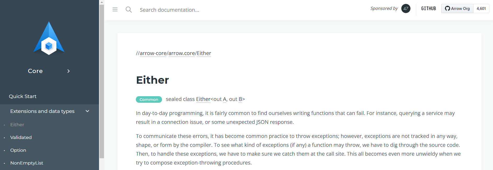
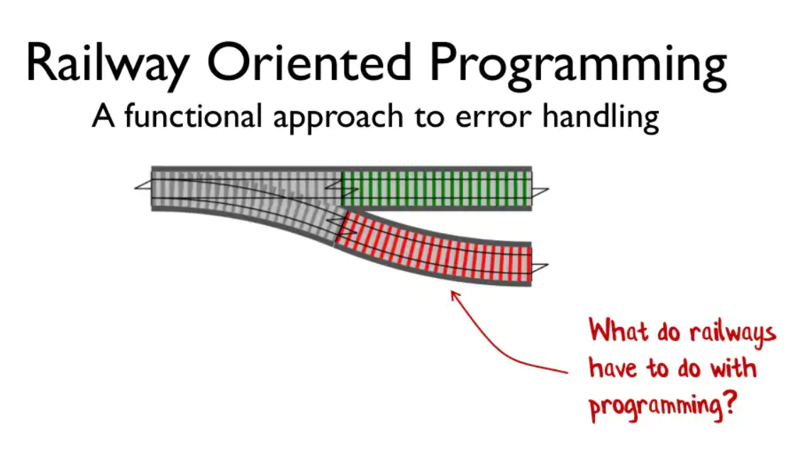
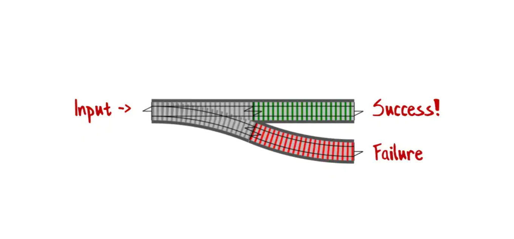
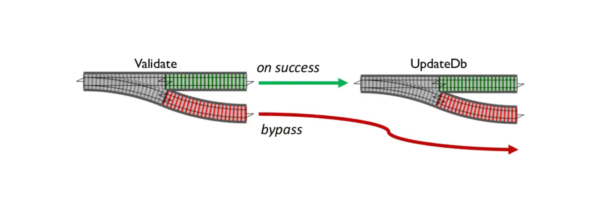
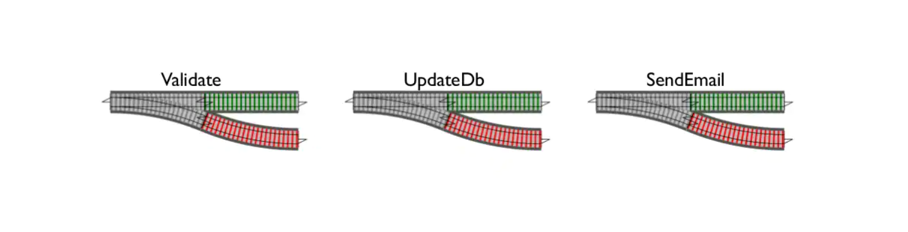
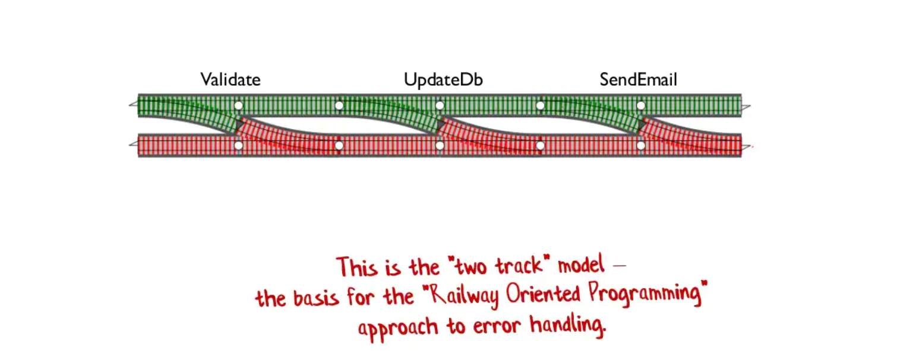
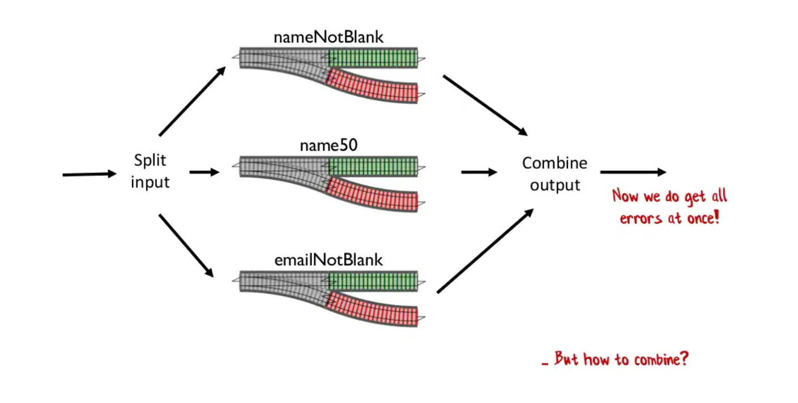

---

theme : "night"
transition: "slide"
highlightTheme: "monokai"
slideNumber: true
title: "Kotlin FP with Arrow"

---

#### ch 4.
### Domain Modeling 
#### and 
### Error Handling

<style>
pre {
  background: #303030;
  padding: 10px 16px;
  border-radius: 0.3em;
  counter-reset: line;
}
pre code[class*="="] .line {
  display: block;
  line-height: 1.8rem;
  font-size: 1em;
}
pre code[class*="="] .line:before {
  counter-increment: line;
  content: counter(line);
  display: inline-block;
  border-right: 3px solid #6ce26c !important;
  padding: 0 .5em;
  margin-right: .5em;
  color: #afafaf !important;
  width: 24px;
  text-align: right;
}

.reveal .slides > section > section {
  text-align: center; 
}

h1,h2,h3,h4 {
  text-align: center;
}

p {
  text-align: center;
}
</style>

--

[return to Outline](../../export/#/2)

--

### References

- https://fsharpforfunandprofit.com/posts/recipe-part2
- https://fsharpforfunandprofit.com/rop/
- https://hltj.me/kotlin/2017/08/25/kotlin-functor-applicative-monad-cn.html

---

### Domain Modeling Recap

- Why Type System
	- Communicate the design in the code
	- Type Safety
- 🔍 **Inline Class**
- ADT ➡️ **Product Type**, **Sum Type**

--

[Domain Modeling Made Functional - Scott Wlaschin](https://youtu.be/2JB1_e5wZmU)


---

### Error Handling

- `Either` ➡️ model error and success
- `Validated` ➡️ accumulate errors
- `Option` ➡️ for absent optional value
	- Null-safety mechanism in Kotlin
- provided by [Arrow-kt](https://arrow-kt.io/docs/core/)

--

### Arrow Core
https://arrow-kt.io/docs/core/


---

### Railway Oriented Programming



--

input ➡️ Success / Failure output



---

### Either

- `Left` side and `Right` side
- Implement by `sealed class`

➡️ Errors on `Left` side as convention

```kotlin=
sealed class Either<out A, out B> {
  data class Left<out A>(val a: A) : Either<A, Nothing>()
  data class Right<out B>(val b: B) : Either<Nothing, B>()

  // ... map, flatMap, fold...
}
// `Nothing` used for the "non-relevant" side
```

--

### Exception ?

- What kind of exceptions a function may throw
	- ➡️ Should dig through the source code
- How to handle exceptions
	- ➡️ Should make sure catch them all

**⚠️ Unwieldy !**


--

```kotlin=
fun main() {
    val charSequence: CharSequence = "Hello!"

    charSequence.repeat(-1)
    // This may throws an IllegalArgumentException and it doesn't show explicitly!
    // We need to make sure we catch the exception!
}
```

```kotlin=
/**
 * Returns a string containing this char sequence repeated [n] times.
 * @throws [IllegalArgumentException] when n < 0.
 * @sample samples.text.Strings.repeat
 */
public actual fun CharSequence.repeat(n: Int): String {
    require(n >= 0) { "Count 'n' must be non-negative, but was $n." }

    // ...
}
```

--

### 🔍 with Either

- Functions return `Either`
  - ➡️ explicit about all scenarios
- More exhaustive
  - ➡️ enforce callers to treat both sides

--

```kotlin=
import arrow.core.Either
import arrow.core.left
import arrow.core.right
import other.model.*

sealed class Error {
    object UploadFileError : Error()
    object FileNotFound : Error()
}

// Left for error
fun uploadFile(file: CustomFile): Either<Error.UploadFileError, CustomFile> =
    Error.UploadFileError.left()

// Right for success
fun downloadFile(fileName: FileName): Either<Error.FileNotFound, CustomFile> =
    CustomFile(
        header = CustomHeader(CustomMetadata(Tag.TYPE_C, Title("Note A"), Author("Joe"))),
        content = Content("Note A Content"),
        fileFormat = CustomFileFormat.DocumentFile(DocumentFileExtension(".doc")),
        name = FileName("Note_A")
    ).right()

fun main() {
    val file = CustomFile(
        header = CustomHeader(CustomMetadata(Tag.TYPE_C, Title("Note A"), Author("Joe"))),
        content = Content("Note A Content"),
        fileFormat = CustomFileFormat.DocumentFile(DocumentFileExtension(".doc")),
        name = FileName("Note_A")
    )

    println(uploadFile(file))
    // Either.Left(playground.Error$UploadFileError@13fee20c)
    println(downloadFile(file.name))
    // Either.Right(CustomFile(header=CustomHeader(metadata=CustomMetadata(tag=TYPE_C, title=Title(value=Note A), author=Author(value=Joe))), content=Content(value=Note A Content), fileFormat=DocumentFile(extension=DocumentFileExtension(value=.doc)), name=FileName(value=Note_A)))
}
```

--

### Evaluation Either Results

➡️ `fold`

```kotlin=
import arrow.core.Either
import arrow.core.right
import other.model.*

sealed class Error {
    object UploadFileError : Error()
    object FileNotFound : Error()
}

fun downloadFile(fileName: FileName): Either<Error.FileNotFound, CustomFile> =
    CustomFile(
        header = CustomHeader(CustomMetadata(Tag.TYPE_C, Title("Note A"), Author("Joe"))),
        content = Content("Note A Content"),
        fileFormat = CustomFileFormat.DocumentFile(DocumentFileExtension(".doc")),
        name = FileName("Note_A")
    ).right()

fun main() {
    val fileName = FileName("Note_A")
    downloadFile(fileName).fold(
        ifLeft = { error -> println(error) },
        ifRight = { customFile -> println("File downloaded: $customFile") }
    )
    // File downloaded: CustomFile(header=CustomHeader(metadata=CustomMetadata(tag=TYPE_C, title=Title(value=Note A), author=Author(value=Joe))), content=Content(value=Note A Content), fileFormat=DocumentFile(extension=DocumentFileExtension(value=.doc)), name=FileName(value=Note_A))
}
```

--

### Either Composition



⬇️


--



⬇️



--

### flatMap

- Chain `Either` sequentially
- A kind of the *M*-word ➡️ **`Monad`**

```kotlin=
import arrow.core.Either
import arrow.core.flatMap
import arrow.core.right
import other.model.*

sealed class Error {
    object UploadFileError : Error()
    object FileNotFound : Error()
    object InvalidTag : Error()
}

fun downloadFile(fileName: FileName): Either<Error.FileNotFound, CustomFile> =
    CustomFile(
        header = CustomHeader(CustomMetadata(Tag.TYPE_C, Title("Note A"), Author("Joe"))),
        content = Content("Note A Content"),
        fileFormat = CustomFileFormat.DocumentFile(DocumentFileExtension(".doc")),
        name = FileName("Note_A")
    ).right()

fun updateTag(file: CustomFile, newTag: Tag): Either<Error.InvalidTag, CustomFile> =
    CustomFile.header.metadata.tag.set(file, newTag).right()

fun uploadFile(file: CustomFile): Either<Error.UploadFileError, CustomFile> =
    file.right()

fun main() {
    val fileName = FileName("Note_A")
    val newTag = Tag.TYPE_A
    val updatedFileTag = downloadFile(fileName)
        .flatMap { customFile -> updateTag(customFile, newTag) }
        .flatMap { customFile -> uploadFile(customFile) }
        .map { customFile -> customFile.header.metadata.tag }

    println(updatedFileTag) // Either.Right(TYPE_A)
}
```

--


--

### flatMap

- Compute over the happy case ➡️ Happy Path
- Short circuit on error ➡️ Failure Path


--

```kotlin=
import arrow.core.Either
import arrow.core.flatMap
import arrow.core.left
import arrow.core.right
import other.model.*

sealed class Error {
    object UploadFileError : Error()
    object FileNotFound : Error()
    object InvalidTag : Error()
}

fun downloadFile(fileName: FileName): Either<Error.FileNotFound, CustomFile> =
    Error.FileNotFound.left() // Error happened!

fun updateTag(file: CustomFile, newTag: Tag): Either<Error.InvalidTag, CustomFile> =
    CustomFile.header.metadata.tag.set(file, newTag).right()

fun uploadFile(file: CustomFile): Either<Error.UploadFileError, CustomFile> =
    file.right()

fun main() {
    val fileName = FileName("Note_A")
    val newTag = Tag.TYPE_A
    val updatedFileTag = downloadFile(fileName) // short circuit: Either.Left(playground.Error$FileNotFound@79b4d0f)
        .flatMap { customFile -> updateTag(customFile, newTag) }
        .flatMap { customFile -> uploadFile(customFile) }
        .map { customFile -> customFile.header.metadata.tag }

    println(updatedFileTag) // Either.Left(playground.Error$FileNotFound@79b4d0f)
}
```

--

### Computation Block

➡️ Translate to chain of `flatMap` at compile time

```kotlin=
import arrow.core.Either
import arrow.core.computations.either
import arrow.core.right
import other.model.*

sealed class Error {
    object UploadFileError : Error()
    object FileNotFound : Error()
    object InvalidTag : Error()
}

fun downloadFile(fileName: FileName): Either<Error.FileNotFound, CustomFile> =
    CustomFile(
        header = CustomHeader(CustomMetadata(Tag.TYPE_C, Title("Note A"), Author("Joe"))),
        content = Content("Note A Content"),
        fileFormat = CustomFileFormat.DocumentFile(DocumentFileExtension(".doc")),
        name = FileName("Note_A")
    ).right()

fun updateTag(file: CustomFile, newTag: Tag): Either<Error.InvalidTag, CustomFile> =
    CustomFile.header.metadata.tag.set(file, newTag).right()

fun uploadFile(file: CustomFile): Either<Error.UploadFileError, CustomFile> =
    file.right()

fun main() {
    val fileName = FileName("Note_A")
    val newTag = Tag.TYPE_A
    val updatedFileTag: Either<Error, Tag> = either.eager {
        val downloadedFile = downloadFile(fileName).bind()
        val updatedTagFile = updateTag(downloadedFile, newTag).bind()
        val uploadedFile = uploadFile(updatedTagFile).bind()
        uploadedFile.header.metadata.tag
    }

    println(updatedFileTag) // Either.Right(TYPE_A)
}
```

--

### 3rd Party Error

🔍 Sometimes you do need to interact with code that can potentially **throw exceptions**

➡️ `Either.catch {} .mapLeft {}`

--

🔍 Map the 3rd party error to **domain error**

```kotlin=
import arrow.core.Either
import other.model.CustomFile
import other.model.Tag

sealed class Error {
    object UploadFileError : Error()
    object FileNotFound : Error()
    object InvalidTag : Error()
    data class InvalidProcess(val msg: String) : Error()

    companion object {
        // map 3rd party error to domain error
        fun fromExternal(e: Throwable): Error = InvalidProcess(msg = "Exception in external service: $e")
    }
}

class FileStorageService {
    // stubbed network request failure
    suspend fun findByTag(tag: Tag): List<CustomFile> = throw RuntimeException("Connection Error!")
}

suspend fun main() {
    val tag = Tag.TYPE_A
    val fileStorageService = FileStorageService()
    val foundFiles: Either<Error, List<CustomFile>> =
        Either.catch { fileStorageService.findByTag(tag) } // Left(RuntimeException("Connection Error!"))
            .mapLeft { e -> Error.fromExternal(e) }

    println(foundFiles)
    // Either.Left(InvalidProcess(msg=Exception in external service: java.lang.RuntimeException: Connection Error!))
}
```

---

### Error Accumulation

Sometimes it would be nice to **have all of these errors** reported simultaneously.

➡️ e.g. validate the input form

--



--

### Validated

- `Invalid` side and `Valid` side

```kotlin=
sealed class Validated<out E, out A> {
  data class Valid<out A>(val a: A) : Validated<Nothing, A>()
  data class Invalid<out E>(val e: E) : Validated<E, Nothing>()

  // ... map, flatMap, fold...
}
```

--

**Accumulate** errors in `Invalid` side

➡️ `ValidatedNel`

--

### ValidatedNel

- Nel ➡️ `NonEmptyList`
- Accumulate invalid cases

🔍 `NonEmptyList` is a data type used in Arrow to model ordered lists that guarantee to have at least one value.

--

### ValidatedNel

```kotlin=
sealed class Validated<out E, out A> {
  data class Valid<out A>(val a: A) : Validated<Nothing, A>()
  data class Invalid<out E>(val e: E) : Validated<E, Nothing>()
}

// NonEmptyList<E> to accumulate errors
typealias ValidatedNel<E, A> = Validated<NonEmptyList<E>, A>
```

--

### Define Validate Functions

```kotlin=
fun validateTag(tag: String): ValidatedNel<Error.ValidationError, Tag> =
    if (!Tag.values().any { it.name == tag }) {
        Error.ValidationError("Tag is invalid").invalidNel()
    }
    else {
        Tag.valueOf(tag).validNel()
    }

fun validateTitle(title: String): ValidatedNel<Error.ValidationError, Title> =
    if (title.isBlank()) {
        Error.ValidationError("Title cannot be blank").invalidNel()
    }
    else {
        Title(title).validNel()
    }

fun validateAuthor(author: String): ValidatedNel<Error.ValidationError, Author> =
    if (!author.matches("^[a-zA-Z]*$".toRegex())) {
        Error.ValidationError("Author needs to be alphabet").invalidNel()
    } else {
        Author(author).validNel()
    }
```

--

### Zip to Accumulate

```kotlin=
import arrow.core.ValidatedNel
import arrow.core.invalidNel
import arrow.core.validNel
import arrow.core.zip
import other.model.Author
import other.model.CustomMetadata
import other.model.Tag
import other.model.Title


sealed class Error {
    // ... //
    data class ValidationError(val msg: String) : Error()
}

fun validateTag(tag: String): ValidatedNel<Error.ValidationError, Tag> =
    if (!Tag.values().any { it.name == tag }) {
        Error.ValidationError("Tag is invalid").invalidNel()
    }
    else {
        Tag.valueOf(tag).validNel()
    }

fun validateTitle(title: String): ValidatedNel<Error.ValidationError, Title> =
    if (title.isBlank()) {
        Error.ValidationError("Title cannot be blank").invalidNel()
    }
    else {
        Title(title).validNel()
    }

fun validateAuthor(author: String): ValidatedNel<Error.ValidationError, Author> =
    if (!author.matches("^[a-zA-Z]*$".toRegex())) {
        Error.ValidationError("Author needs to be alphabet").invalidNel()
    } else {
        Author(author).validNel()
    }

fun main() {
    val myMetadata = validateTag("TYPE_C").zip(
        validateTitle("Functional Programming in Kotlin"),
        validateAuthor("Joe")
    ) { tag, title, author ->
        CustomMetadata(tag, title, author)
    }

    println(myMetadata)
    // Validated.Valid(CustomMetadata(
    //  tag=TYPE_C, 
    //  title=Title(value=Functional Programming in Kotlin), 
    //  author=Author(value=Joe)
    // ))

    val strangeMetadata = validateTag("TYPE_Z").zip(
        validateTitle(""),
        validateAuthor("^_^")
    ) { tag, title, author ->
        CustomMetadata(tag, title, author)
    }

    println(strangeMetadata)
    // Validated.Invalid(NonEmptyList(
    //  ValidationError(msg=Tag is invalid),
    //  ValidationError(msg=Title cannot be blank),
    //  ValidationError(msg=Author needs to be alphabet)
    // ))
}
```

--

#### Validate Domain Model Creation

➡️ Validate how we construct data

```kotlin=
import arrow.core.*
import other.model.Author
import other.model.Tag
import other.model.Title

sealed class Error {
    // ... //
    data class ValidationError(val msg: String) : Error()
}

@JvmInline
value class SimpleFileName private constructor(val value: String) {
    companion object {
        fun create(value: String): ValidatedNel<Error.ValidationError, SimpleFileName> = when {
            !value.matches("^[a-zA-Z0-9_-]*\$".toRegex()) -> Error.ValidationError("FileName needs to be alphanumeric, underline, or hyphen").invalidNel()
            value.isBlank() -> Error.ValidationError("FileName cannot be blank").invalidNel()
            else -> Valid(SimpleFileName(value)) // SimpleFileName(value).validNel()
        }
    }
}

@JvmInline
value class SimpleFileFormat private constructor(val value: String) {
    companion object {
        fun create(value: String): ValidatedNel<Error.ValidationError, SimpleFileFormat> = when {
            !value.matches("^\\.[a-zA-Z]*\$".toRegex()) -> Error.ValidationError("FileFormat needs to be alphabet and start with dot").invalidNel()
            value.isBlank() -> Error.ValidationError("FileFormat cannot be blank").invalidNel()
            else -> Valid(SimpleFileFormat(value)) // SimpleFileFormat(value).validNel()
        }
    }
}

data class SimpleFile(
    val name: SimpleFileName,
    val fileFormat: SimpleFileFormat
)

fun main() {
    val myFile = SimpleFileName.create("FP_note").zip(
        SimpleFileFormat.create(".doc")
    ) { fileName, fileFormat ->
        SimpleFile(fileName, fileFormat)
    }

    println(myFile)
    // Validated.Valid(SimpleFile(
    //  name=SimpleFileName(value=FP_note), 
    //  fileFormat=SimpleFileFormat(value=.doc)
    // ))

    val strangeFile = SimpleFileName.create("Hello.World!").zip(
        SimpleFileFormat.create(".png") // only file format is valid
    ) { fileName, fileFormat ->
        SimpleFile(fileName, fileFormat)
    }

    println(strangeFile)
    // Validated.Invalid(NonEmptyList(
    //  ValidationError(msg=FileName needs to be alphanumeric, underline, or hyphen)
    // ))
}
```

---

### Either vs. Validated

- `Either`
  - ➡️ Short circuit on error (*Fail Fast*)
- `Validated`, `ValidatedNel`
  - ➡️ Accumulate invalid cases (*Fail Slow*)

--

### Either & Validated

```kotlin=
import arrow.core.*
import arrow.core.computations.either
import other.model.*

data class RawMetadata(
    val tag: String,
    val title: String,
    val author: String
)

sealed class Error {
    object UploadFileError : Error()
    object FileNotFound : Error()
    object UpdateMetadataError : Error()
    data class ValidationError(val msg: String) : Error()
    data class InvalidMetadataError(val nel: List<ValidationError>) : Error()
}

fun ValidatedNel<Error.ValidationError, CustomMetadata>.toDomainError(): Validated<Error.InvalidMetadataError, CustomMetadata> =
    mapLeft { Error.InvalidMetadataError(it) }

fun validateTag(tag: String): ValidatedNel<Error.ValidationError, Tag> =
    if (!Tag.values().any { it.name == tag }) {
        Error.ValidationError("Tag is invalid").invalidNel()
    } else {
        Tag.valueOf(tag).validNel()
    }

fun validateTitle(title: String): ValidatedNel<Error.ValidationError, Title> =
    if (title.isBlank()) {
        Error.ValidationError("Title cannot be blank").invalidNel()
    } else {
        Title(title).validNel()
    }

fun validateAuthor(author: String): ValidatedNel<Error.ValidationError, Author> =
    if (!author.matches("^[a-zA-Z]*$".toRegex())) {
        Error.ValidationError("Author needs to be alphabet").invalidNel()
    } else {
        Author(author).validNel()
    }

fun validateMetadata(rawTag: String, rawTitle: String, rawAuthor: String): ValidatedNel<Error.ValidationError, CustomMetadata> =
    validateTag(rawTag).zip(
        validateTitle(rawTitle),
        validateAuthor(rawAuthor)
    ) { tag, title, author ->
        CustomMetadata(tag, title, author)
    }

fun downloadFile(fileName: FileName): Either<Error.FileNotFound, CustomFile> =
    CustomFile(
        header = CustomHeader(CustomMetadata(Tag.TYPE_C, Title("Note A"), Author("Joe"))),
        content = Content("Note A Content"),
        fileFormat = CustomFileFormat.DocumentFile(DocumentFileExtension(".doc")),
        name = FileName("Note_A")
    ).right()

fun updateMetadata(file: CustomFile, newMetadata: CustomMetadata): Either<Error.UpdateMetadataError, CustomFile> =
    CustomFile.header.metadata.set(file, newMetadata).right()

fun uploadFile(file: CustomFile): Either<Error.UploadFileError, CustomFile> =
    file.right()

fun updateCloudMetadata(targetFileName: FileName, newRawMetadata: RawMetadata): Either<Error, CustomMetadata> =
    either.eager {
        val downloadedFile = downloadFile(targetFileName).bind()
        val validMetadata = validateMetadata(newRawMetadata.tag, newRawMetadata.title, newRawMetadata.author).toDomainError().bind()
        val updatedMetadataFile = updateMetadata(downloadedFile, validMetadata).bind()
        val uploadedFile = uploadFile(updatedMetadataFile).bind()
        uploadedFile.header.metadata
    }

fun main() {
    val fileName = FileName("Note_A")
    val newRawMetadata = RawMetadata("TYPE_A", "Functional Programming in Kotlin", "Joe")
    val updatedFileMetadata = updateCloudMetadata(fileName, newRawMetadata)

    println(updatedFileMetadata) // Either.Right(CustomMetadata(tag=TYPE_A, title=Title(value=Functional Programming in Kotlin), author=Author(value=Joe)))

    val strangeRawMetadata = RawMetadata("TYPE_Z", "Functional Programming in Kotlin", "Joe")
    val strangeFileMetadata = updateCloudMetadata(fileName, strangeRawMetadata)

    println(strangeFileMetadata) // Either.Left(InvalidMetadataError(nel=NonEmptyList(ValidationError(msg=Tag is invalid))))
}
```

---

### Option

- `Option<A>`
	- if value `A` is present ➡️ `Some<A>`
	- if value is absent ➡️ `None`

```kotlin=
sealed class Option<out A> {
  // ... map, flatMap, fold...
}

data class Some<out A> : Option<A>
fun <A> none() : Option<A> { /* ... */ }
```

--

➡️ `fold`

```kotlin=
import arrow.core.Option
import arrow.core.Some
import arrow.core.none

fun evalOption(option: Option<String>): String =
    option.fold(
        ifEmpty = { "No value" },
        ifSome =  { it }
    )

fun main() {
    val someValue: Option<String> = Some("This is Some value.")
    println(evalOption(someValue)) // This is Some value.

    val noneValue: Option<String> = none()
    println(evalOption(noneValue)) // No value
}
```

--

### Option

- Can be *emulated* by `Either<Unit, A>` and nullable variable `A?`
	- https://github.com/arrow-kt/arrow-core/issues/114

--

- For **testability**, **exhaustivity**
- As a **FP languages idiom**

➡️ use `Option`

<font size="5">🔍 Also to support *some use cases* - Cannot pass `null` value to an `Observable` in RxJava </font>

--

### Convert from nullable variable

➡️ `Option.fromNullable()`

```kotlin=
import arrow.core.Option

fun evalOption(option: Option<String>): String =
    option.fold(
        ifEmpty = { "No value" },
        ifSome =  { it }
    )

fun main() {
    val helloStr: String? = "Hello!"
    val optionHelloStr = Option.fromNullable(helloStr)
    println(evalOption(optionHelloStr)) // Hello!

    val nullStr: String? = null
    val optionNullStr = Option.fromNullable(nullStr)
    println(evalOption(optionNullStr)) // No value
}
```

--

### Either & Validated & Option

```kotlin=
import arrow.core.*
import arrow.core.computations.either
import other.model.*

data class RawMetadata(
    val tag: String,
    val title: String,
    val author: String
)

sealed class Error {
    object UploadFileError : Error()
    object FileNotFound : Error()
    object FileNotFoundByAuthor : Error()
    object UpdateMetadataError : Error()
    data class ValidationError(val msg: String) : Error()
    data class InvalidMetadataError(val nel: List<ValidationError>) : Error()
}

fun ValidatedNel<Error.ValidationError, CustomMetadata>.toDomainError(): Validated<Error.InvalidMetadataError, CustomMetadata> =
    mapLeft { Error.InvalidMetadataError(it) }

fun validateTag(tag: String): ValidatedNel<Error.ValidationError, Tag> =
    if (!Tag.values().any { it.name == tag }) {
        Error.ValidationError("Tag is invalid").invalidNel()
    } else {
        Tag.valueOf(tag).validNel()
    }

fun validateTitle(title: String): ValidatedNel<Error.ValidationError, Title> =
    if (title.isBlank()) {
        Error.ValidationError("Title cannot be blank").invalidNel()
    } else {
        Title(title).validNel()
    }

fun validateAuthor(author: String): ValidatedNel<Error.ValidationError, Author> =
    if (!author.matches("^[a-zA-Z]*$".toRegex())) {
        Error.ValidationError("Author needs to be alphabet").invalidNel()
    } else {
        Author(author).validNel()
    }

fun validateMetadata(rawTag: String, rawTitle: String, rawAuthor: String): ValidatedNel<Error.ValidationError, CustomMetadata> =
    validateTag(rawTag).zip(
        validateTitle(rawTitle),
        validateAuthor(rawAuthor)
    ) { tag, title, author ->
        CustomMetadata(tag, title, author)
    }

fun downloadFile(fileName: FileName): Either<Error.FileNotFound, CustomFile> =
    CustomFile(
        header = CustomHeader(CustomMetadata(Tag.TYPE_C, Title("Note A"), Author("Joe"))),
        content = Content("Note A Content"),
        fileFormat = CustomFileFormat.DocumentFile(DocumentFileExtension(".doc")),
        name = FileName("Note_A")
    ).right()

fun updateMetadata(file: CustomFile, newMetadata: CustomMetadata): Either<Error.UpdateMetadataError, CustomFile> =
    CustomFile.header.metadata.set(file, newMetadata).right()

fun uploadFile(file: CustomFile): Either<Error.UploadFileError, CustomFile> =
    file.right()

fun findFileByAuthor(files: CustomFiles, author: Author): Option<CustomFile> =
    Option.fromNullable(files.customFiles.find { it.header.metadata.author == author })

fun updateCloudMetadataByAuthor(
    files: CustomFiles,
    author: Author,
    newRawMetadata: RawMetadata
): Either<Error, CustomMetadata> =
    either.eager {
        val foundFileName = findFileByAuthor(files, author).toEither(
            ifEmpty = { Error.FileNotFoundByAuthor }
        ).map {
            it.name
        }.bind()
        val downloadedFile = downloadFile(foundFileName).bind()
        val validMetadata =
            validateMetadata(newRawMetadata.tag, newRawMetadata.title, newRawMetadata.author).toDomainError().bind()
        val updatedMetadataFile = updateMetadata(downloadedFile, validMetadata).bind()
        val uploadedFile = uploadFile(updatedMetadataFile).bind()
        uploadedFile.header.metadata
    }

fun main() {
    val customFiles = CustomFiles(
        listOf(
            CustomFile(
                header = CustomHeader(CustomMetadata(Tag.TYPE_C, Title("Note A"), Author("Joe"))),
                content = Content("Note A Content"),
                fileFormat = CustomFileFormat.DocumentFile(DocumentFileExtension(".doc")),
                name = FileName("Note_A")
            ),
            CustomFile(
                header = CustomHeader(CustomMetadata(Tag.TYPE_C, Title("Photo A"), Author("Sam"))),
                content = Content("(Binary Encoded)"),
                fileFormat = CustomFileFormat.MediaFile.ImageFile(ImageFileExtension(".jpg")),
                name = FileName("Photo_A")
            ),
            CustomFile(
                header = CustomHeader(CustomMetadata(Tag.TYPE_C, Title("Video A"), Author("Mark"))),
                content = Content("(Binary Encoded)"),
                fileFormat = CustomFileFormat.MediaFile.VideoFile(VideoFileExtension(".mp4"), BitRateKBitPerS(700)),
                name = FileName("Video_A")
            ),
            CustomFile(
                header = CustomHeader(CustomMetadata(Tag.TYPE_C, Title("Audio A"), Author("Tom"))),
                content = Content("(Binary Encoded)"),
                fileFormat = CustomFileFormat.MediaFile.AudioFile(AudioFileExtension(".mp3"), BitRateKBitPerS(128)),
                name = FileName("Audio_A")
            )
        )
    )
    val targetAuthor = Author("Joe")

    val newRawMetadata = RawMetadata("TYPE_A", "Functional Programming in Kotlin", "Joe")
    val updatedFileMetadata = updateCloudMetadataByAuthor(customFiles, targetAuthor, newRawMetadata)

    println(updatedFileMetadata) // Either.Right(CustomMetadata(tag=TYPE_A, title=Title(value=Functional Programming in Kotlin), author=Author(value=Joe)))

    val strangeRawMetadata = RawMetadata("TYPE_Z", "Functional Programming in Kotlin", "Joe")
    val strangeFileMetadata = updateCloudMetadataByAuthor(customFiles, targetAuthor, strangeRawMetadata)

    println(strangeFileMetadata) // Either.Left(InvalidMetadataError(nel=NonEmptyList(ValidationError(msg=Tag is invalid))))
}
```

---

### Flatten Iterable Collection

- Flatten `Iterable` to make it *easier to work with*

➡️ **Monad**

<font size="6">⚠️ `Array<T>` doesn't implement `Iterable<T>`</font>

--

### Traverse

- `List<Either<E, A>>`
  - ➡️ `Either<E, List<A>>`
- `List<ValidateNel<E, A>>`
  - ➡️ `ValidateNel<E, List<A>>`
- `List<Option<A>>`
  - ➡️ `Option<List<A>>`

--

- `traverse` ➡️ flatten after *operation*
- `sequence` ➡️ reverse a flat to List
  - <font size="6">e.g. `Either<E, List<A>>` ➡️ `List<Either<E, A>>`</font>
  - <font size="6">the Failure Path will be converted to **empty List**</font>

🔍 Note that the `sequence` has *different semantics* from `parSequence` in [Arrow Fx](https://arrow-kt.io/docs/apidocs/arrow-fx-coroutines/arrow.fx.coroutines/par-sequence.html)

--

```kotlin=
import arrow.core.*

sealed class Error {
    object NonPositiveInteger : Error()
}

fun squarePositiveInteger(num: Int): Either<Error, Int> =
    if (num > 0) {
        (num * num).right()
    } else {
        Error.NonPositiveInteger.left()
    }

fun main() {
    val someValues: List<Option<Int>> = listOf(Some(1), Some(2), Some(3))
    println(someValues) // [Option.Some(1), Option.Some(2), Option.Some(3)]
    val flatSomeValues = someValues.traverseOption { it } // someValues.traverseOption(::identity)
    println(flatSomeValues) // Option.Some([1, 2, 3])

    val nums = listOf(1, 2, 3)
    val squareNums = nums.map { squarePositiveInteger(it) }
    println(squareNums) // [Either.Right(1), Either.Right(4), Either.Right(9)]
    val flatSquareNums = nums.traverseEither { squarePositiveInteger(it) }
    println(flatSquareNums) // Either.Right([1, 4, 9])
    println(flatSquareNums.sequence()) // [Either.Right(1), Either.Right(4), Either.Right(9)]


    val numsWithNegative = listOf(1, 2, -5, 3)
    val flatSquareNumsWithNegative = numsWithNegative.traverseEither { squarePositiveInteger(it) }
    println(flatSquareNumsWithNegative) // Either.Left(playground.Error$NonPositiveInteger@735b478)
    println(flatSquareNumsWithNegative.sequence()) // []
}
```

--

#### Either & Validated & Option & Traverse

```kotlin=
import arrow.core.*
import arrow.core.computations.either
import other.model.*

data class RawMetadata(
    val tag: String,
    val title: String,
    val author: String
)

sealed class Error {
    object UploadFileError : Error()
    object FileNotFound : Error()
    object FileNotFoundByAuthor : Error()
    object UpdateMetadataError : Error()
    data class ValidationError(val msg: String) : Error()
    data class InvalidMetadataError(val nel: List<ValidationError>) : Error()
}

fun ValidatedNel<Error.ValidationError, CustomMetadata>.toDomainError(): Validated<Error.InvalidMetadataError, CustomMetadata> =
    mapLeft { Error.InvalidMetadataError(it) }

fun validateTag(tag: String): ValidatedNel<Error.ValidationError, Tag> =
    if (!Tag.values().any { it.name == tag }) {
        Error.ValidationError("Tag is invalid").invalidNel()
    } else {
        Tag.valueOf(tag).validNel()
    }

fun validateTitle(title: String): ValidatedNel<Error.ValidationError, Title> =
    if (title.isBlank()) {
        Error.ValidationError("Title cannot be blank").invalidNel()
    } else {
        Title(title).validNel()
    }

fun validateAuthor(author: String): ValidatedNel<Error.ValidationError, Author> =
    if (!author.matches("^[a-zA-Z]*$".toRegex())) {
        Error.ValidationError("Author needs to be alphabet").invalidNel()
    } else {
        Author(author).validNel()
    }

fun validateMetadata(
    rawTag: String,
    rawTitle: String,
    rawAuthor: String
): ValidatedNel<Error.ValidationError, CustomMetadata> =
    validateTag(rawTag).zip(
        validateTitle(rawTitle),
        validateAuthor(rawAuthor)
    ) { tag, title, author ->
        CustomMetadata(tag, title, author)
    }

fun downloadFiles(fileNames: List<FileName>): Either<Error.FileNotFound, List<CustomFile>> =
    listOf(
        CustomFile(
            header = CustomHeader(CustomMetadata(Tag.TYPE_C, Title("Note A"), Author("Joe"))),
            content = Content("Note A Content"),
            fileFormat = CustomFileFormat.DocumentFile(DocumentFileExtension(".doc")),
            name = FileName("Note_A")
        ),
        CustomFile(
            header = CustomHeader(CustomMetadata(Tag.TYPE_C, Title("Video A"), Author("Mark"))),
            content = Content("(Binary Encoded)"),
            fileFormat = CustomFileFormat.MediaFile.VideoFile(VideoFileExtension(".mp4"), BitRateKBitPerS(700)),
            name = FileName("Video_A")
        )
    ).right()

fun updateMetadata(
    files: List<CustomFile>,
    newMetadata: CustomMetadata
): Either<Error.UpdateMetadataError, List<CustomFile>> =
    files.traverseEither { file ->
        CustomFile.header.metadata.set(file, newMetadata).right()
    }

fun uploadFiles(files: List<CustomFile>): Either<Error.UploadFileError, List<CustomFile>> =
    files.traverseEither { it.right() } // due to traverse with ::identity, this line equals to `files.right()`

fun findFilesByAuthors(files: CustomFiles, authors: List<Author>): Option<List<CustomFile>> =
    authors.traverseOption { author ->
        Option.fromNullable(files.customFiles.find { it.header.metadata.author == author })
    }

fun updateCloudMetadataByAuthors(
    files: CustomFiles,
    authors: List<Author>,
    newRawMetadata: RawMetadata
): Either<Error, List<CustomFile>> =
    either.eager {
        val foundFileNames = findFilesByAuthors(files, authors).toEither(
            ifEmpty = { Error.FileNotFoundByAuthor }
        ).map { files ->
            files.map {
                it.name
            }
        }.bind()
        val downloadedFiles = downloadFiles(foundFileNames).bind()
        val validMetadata =
            validateMetadata(newRawMetadata.tag, newRawMetadata.title, newRawMetadata.author).toDomainError().bind()
        val updatedMetadataFiles = updateMetadata(downloadedFiles, validMetadata).bind()
        val uploadedFiles = uploadFiles(updatedMetadataFiles).bind()
        uploadedFiles
    }

fun main() {
    val customFiles = CustomFiles(
        listOf(
            CustomFile(
                header = CustomHeader(CustomMetadata(Tag.TYPE_C, Title("Note A"), Author("Joe"))),
                content = Content("Note A Content"),
                fileFormat = CustomFileFormat.DocumentFile(DocumentFileExtension(".doc")),
                name = FileName("Note_A")
            ),
            CustomFile(
                header = CustomHeader(CustomMetadata(Tag.TYPE_C, Title("Photo A"), Author("Sam"))),
                content = Content("(Binary Encoded)"),
                fileFormat = CustomFileFormat.MediaFile.ImageFile(ImageFileExtension(".jpg")),
                name = FileName("Photo_A")
            ),
            CustomFile(
                header = CustomHeader(CustomMetadata(Tag.TYPE_C, Title("Video A"), Author("Mark"))),
                content = Content("(Binary Encoded)"),
                fileFormat = CustomFileFormat.MediaFile.VideoFile(VideoFileExtension(".mp4"), BitRateKBitPerS(700)),
                name = FileName("Video_A")
            ),
            CustomFile(
                header = CustomHeader(CustomMetadata(Tag.TYPE_C, Title("Audio A"), Author("Tom"))),
                content = Content("(Binary Encoded)"),
                fileFormat = CustomFileFormat.MediaFile.AudioFile(AudioFileExtension(".mp3"), BitRateKBitPerS(128)),
                name = FileName("Audio_A")
            )
        )
    )
    val targetAuthors = listOf(Author("Joe"), Author("Mark"))

    val newRawMetadata = RawMetadata("TYPE_A", "Functional Programming in Kotlin", "Joe")
    val updatedFiles = updateCloudMetadataByAuthors(customFiles, targetAuthors, newRawMetadata)
    println(updatedFiles)
    // Either.Right([
    //  CustomFile(header=CustomHeader(metadata=CustomMetadata(tag=TYPE_A, title=Title(value=Functional Programming in Kotlin), author=Author(value=Joe))), content=Content(value=Note A Content), fileFormat=DocumentFile(extension=DocumentFileExtension(value=.doc)), name=FileName(value=Note_A)), 
    //  CustomFile(header=CustomHeader(metadata=CustomMetadata(tag=TYPE_A, title=Title(value=Functional Programming in Kotlin), author=Author(value=Joe))), content=Content(value=(Binary Encoded)), fileFormat=VideoFile(extension=VideoFileExtension(value=.mp4), bitRateKBitPerS=BitRateKBitPerS(value=700)), name=FileName(value=Video_A))
    // ])

    val strangeRawMetadata = RawMetadata("TYPE_Z", "Functional Programming in Kotlin", "Joe")
    val strangeFiles = updateCloudMetadataByAuthors(customFiles, targetAuthors, strangeRawMetadata)
    println(strangeFiles)
    // Either.Left(InvalidMetadataError(nel=NonEmptyList(ValidationError(msg=Tag is invalid))))
}
```

---

### Recap #1

- Railway Oriented Programming
  - ➡️ Success / Failure output
- `Either<E, A>`
  - Evaluation ➡️ `fold`
  - Composition ➡️ `flatMap`
    - ➡️ `either.eager {}` with `bind()`
  - Handling 3rd Party Error
    - ➡️ `Either.catch {} .mapLeft {}`
  - Short circuit on error

--

### Recap #2

- `Validated<E, A>` & `ValidatedNel<E, A>`
	- Accumulate invalid cases ➡️ `zip`	
- `Option<A>`
	- Absent optional value ➡️ `Some<A>`, `None`
	- `Option.fromNullable()`

--

### Recap #3

- Flatten Iterable
  - `traverse`
    - `Iterable<Either<E, A>>`
      - ➡️ `Either<E, Iterable<A>>`
  - `sequence`
    - `Either<E, Iterable<A>>`
      - ➡️ `List<Either<E, A>>`