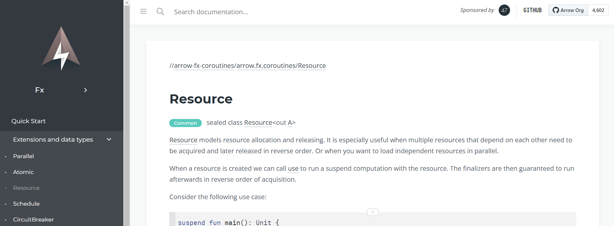

---

theme : "night"
transition: "slide"
highlightTheme: "monokai"
slideNumber: true
title: "Kotlin FP with Arrow"

---

#### ch 6.
### Safe Resource Handling

<style>
pre {
  background: #303030;
  padding: 10px 16px;
  border-radius: 0.3em;
  counter-reset: line;
}
pre code[class*="="] .line {
  display: block;
  line-height: 1.8rem;
  font-size: 1em;
}
pre code[class*="="] .line:before {
  counter-increment: line;
  content: counter(line);
  display: inline-block;
  border-right: 3px solid #6ce26c !important;
  padding: 0 .5em;
  margin-right: .5em;
  color: #afafaf !important;
  width: 24px;
  text-align: right;
}

.reveal .slides > section > section {
  text-align: center; 
}

h1,h2,h3,h4 {
  text-align: center;
}

p {
  text-align: center;
}
</style>

--

[return to Outline](../../export/#/2)

--

### References

- https://kotlin.github.io/kotlinx.coroutines/index.html

---

### What is a resource ?

- Database
- File (IO)
- Connection
- etc.

--

### What is safe handling ?

- Thread safety
- Unchanged data state
- No risk of concurrent modification
- No need of synchronization
- No risk of deadlocks

➡️ leverage Immutability

--

### Immutable Data

- `val` ➡️ still mutable when it points to a mutable data structure
  - `val numbers = mutableListOf(1, 2, 3)`
- Immutable collections ➡️ read-only
  - `val numbers = listOf(1, 2, 3)`
- 3rd party provided data structure for safe-accessed concurrency

--

### 3rd Party Libraries

- Arrow-kt
  - `Atomic`
- Kotlinx
  - `Mutex` ➡️ Mutual exclusion for coroutines
  - `Semaphore` ➡️ Counting semaphore for coroutines
  - `Channel` ➡️ Communication between a sender and a receiver
    - <font size="6">similar to `BlockingQueue` in Java, but with **suspending** operations</font>
- etc.
  
--

### Atomic

- provided by [Arrow-kt](https://arrow-kt.io/docs/apidocs/arrow-fx-coroutines/arrow.fx.coroutines/-atomic/)
- A wrapper around Kotlinx `AtomicFU`

```kotlin=
// sample for atomic
```

---

### Working with a resource

- Acquisition
- Using
- Releasing ➡️ always need to do

🔍 Asynchronous & Coroutines

🔍 Dependency Injection

--

### Try / Catch / Finally

- Problems with handling `cancel()` in **coroutines**
  - `catch` captures also `CancellationException`
  - `acquire` and `release` need to be `NonCancellable`
- Can become messy with segregated error handling

--

```kotlin=
// sample for try/catch/finally with CancellationException, NonCancellable
```

---

### Safe Resource Handling

- `bracket` & `bracketCase`
- `Resource`
- `guarantee` & `guaranteeCase`
- `onCancel`
- `CircuitBreaker`
- provided by [Arrow-kt](https://arrow-kt.io/docs/fx/)

--

### Arrow Fx

https://arrow-kt.io/docs/fx/


--

🔍 Acquire, use, and release resources *regardless of how and from where they are used*.

🔍 Supports any other Arrow Fx operators

➡️ `suspend` !

--

### Always release

A resource should be released in 3 cases
- Completion
- Cancellation
- Failure

---

### bracket

Declare `acquire`, `use`, and `release`

```kotlin=
// sample for bracket definition
```

--

### bracketCase

Same as `bracket`, but `release` by case

```kotlin=
// sample for bracketCase definition
```

--

### Error Handling

- Release if there is an error while using the resource
- `bracket` and `bracketCase` will rethrow exceptions
  - ➡️ use `Either.catch {}`

--

```kotlin=
// sample for bracketCase error handling
```

--

### Cancellation Handling

Release when the coroutine is cancelled

```kotlin=
// sample for bracketCase Cancellation handling
```

--

If you fail or cancel on `acquire`, `release` is not called

➡️ Can't release something we never acquired

--

### Limitations

`bracket` and `bracketCase` tied to decide how to **use** the resource when we `acquire` it

➡️ Can we separate `acquire` and `use` ?

```kotlin=
// sample for bracket and bracketCase definition
```

---

### Resource

- Declare `acquire` and `release`
- It's a datatype
  - ➡️ we can pass around or inject and reuse
- It's a **Monad**
  - ➡️ `map`, `flatMap`, `traverse`, ...
  - ➡️ compose with other `suspend` operations
  
--

```kotlin=
// sample for Resource
```

--

<font size="6">⚠️ Can be inefficient to acquire and release every time if we have many operations to perform over the same resource</font>

```kotlin=
// sample for use the same item several times
```

--

### Solve the Inefficiency

- Fit everything inside the `use` lambda
- Leverage architecture design
  - ➡️ reuse connection from a pool
- Push the problem into implementation details

--

<font size="6">🔍 Resources guarantee that their release finalizers are always invoked in the correct **order**</font>

```kotlin=
// sample for Resource with sequence source 
```

--

If you fail or cancel on `acquire`, `release` is not called

➡️ Can't release something we never acquired

🔍 `acquire` & `release` step are `NonCancellable`
 
--

### Resource DSL

`resource` with `release` / `releaseCase`

```kotlin=
// sample for Resource DSL
```

--

### Error Handling

- Release if there is an error while using the resource
- `use` will rethrow exceptions
  - ➡️ use `Either.catch {}`

--

```kotlin=
// sample for Resource error handling
```

--

### Cancellation Handling

Release when the coroutine is cancelled

```kotlin=
// sample for Resource Cancellation handling
```

---

### guarantee

- Guarantee execution of a given `finalizer` after `fa` regardless of success, error or cancellation
- Not meant for handling resources but any suspended effects

```kotlin=
// sample for guarantee definition
```

--

### guaranteeCase

Same as `guarantee`, but `finalizer` with case

```kotlin=
// sample for guaranteeCase definition
```

--

### Error Handling

- Run `finalizer` if there is an error while running the effect
- `guarantee` and `guaranteeCase` will rethrow exceptions after running `finalizer`
  - ➡️ use `Either.catch {}`

--

```kotlin=
// sample for guaranteeCase error handling
```

--

### Cancellation Handling

Run `finalizer` when the coroutine is cancelled

```kotlin=
// sample for guaranteeCase Cancellation handling
```

--

### onCancel

Register an `onCancel` handler after `fa`

➡️ only be invoked when the coroutine is cancelled

```kotlin=
// sample for onCancel Cancellation handling
```

---

### CircuitBreaker

<font size="6">🔍 Detect failures and prevent a failure from constantly recurring</font>

➡️ **Protect** resources or services from being overloaded

--

`CircuitBreaker` has 3 `CircuitBreaker.State`
- `Closed`
  - ➡️ normal state
- `Open`
  - ➡️ short-circuit/fail-fast all requests
- `HalfOpen`
  - ➡️ while it's allowing a request to go through, as a *test request*
  
--

```kotlin=
// sample for CircuitBreaker
```  

---

### Recap #1

- Safe Resource Handling leverages Immutability
  - `Atomic`, `Mutex`, `Semaphore`, `Channel`, ...
- Handle Resource
  - `bracket` & `bracketCase` ➡️ `acquire`, `use`, `release`
  - `Resource` ➡️ `acquire`, `release`
    - guarantee release finalizers are always invoked in the correct **order**

--

### Recap #2

- Handle Effect
  - `guarantee` & `guaranteeCase` ➡️ `fa`, `finalizer`
  - `onCancel` ➡️ `fa`, `onCancel`
- `CircuitBreaker` ➡️ `Closed`, `Open`, `HalfOpen`
  - **Protect** resources or services from being overloaded
