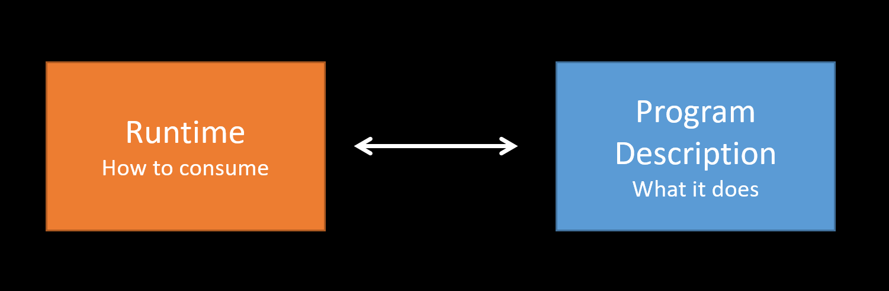
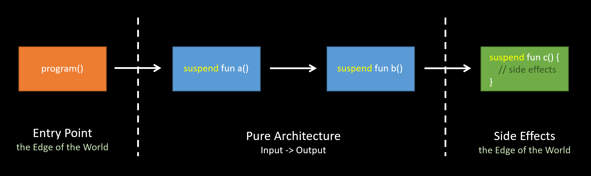
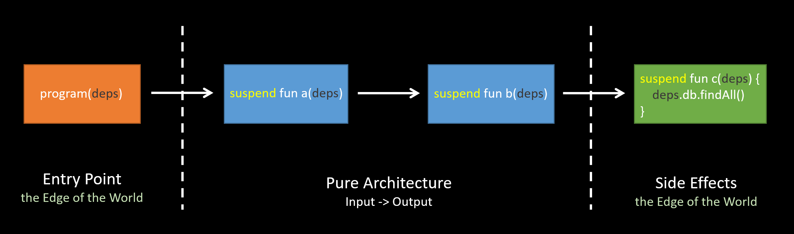
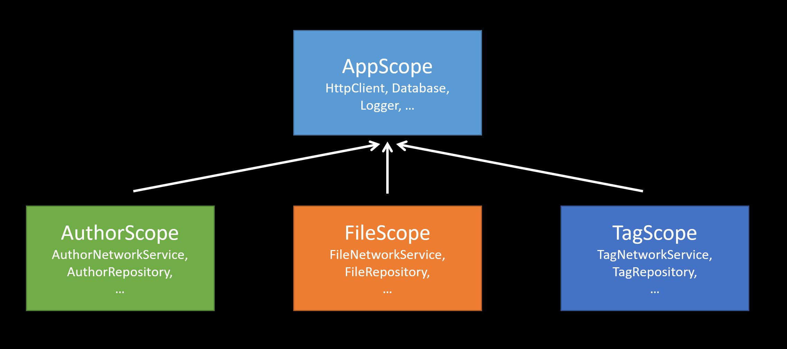

---

theme : "night"
transition: "slide"
highlightTheme: "monokai"
slideNumber: true
title: "Kotlin FP with Arrow"

---

#### ch 8. 
### Functional Architecture

<style>
pre {
  background: #303030;
  padding: 10px 16px;
  border-radius: 0.3em;
  counter-reset: line;
}
pre code[class*="="] .line {
  display: block;
  line-height: 1.8rem;
  font-size: 1em;
}
pre code[class*="="] .line:before {
  counter-increment: line;
  content: counter(line);
  display: inline-block;
  border-right: 3px solid #6ce26c !important;
  padding: 0 .5em;
  margin-right: .5em;
  color: #afafaf !important;
  width: 24px;
  text-align: right;
}

.reveal .slides > section > section {
  text-align: center; 
}

h1,h2,h3,h4 {
  text-align: center;
}

p {
  text-align: center;
}
</style>

--

[return to Outline](../../export/#/2)

--

### References

- https://book.kotlincn.net/
- https://softwareengineering.stackexchange.com/questions/275891/is-functional-programming-a-viable-alternative-to-dependency-injection-patterns

---

### Runtime & Program Logic



--

### Runtime

🔍 interpreter of the program

- Decide how to consume the program
  - ➡️ pick the execution strategy
- Provide dependencies to the program
  - ➡️ implementation detail

--

### Program Logic

🔍  agnostic of the runtime

- Program logic can remain pure and abstract
  - ➡️ lift the function
  - ➡️ `suspend`
- Pure edge to edge
  - ➡️ **input -> output**
  
--

### How about Side Effect ?

➡️ `suspend`

- Lift the function and defer side effects to runtime
  - the entry point requires providing a runtime (*Coroutine*) to consume
- Allows keeping side effects tracked by compiler
  - can't be called from everywhere
- Pure Architecture
  - push side effects to the **edges**
  
--

#### Push Side Effects to the Edges



🔍 Note the side effects are flagged with `suspend`

---

### Logger in FP

How to do logging in Functional Programming ?
- [Reference 1](https://www.raywenderlich.com/9527-functional-programming-with-kotlin-and-arrow-getting-started#toc-anchor-018)
- [Reference 2](https://darrmirr.medium.com/logging-at-functional-programming-efd95da734d1)
- [Reference 3](https://www.reddit.com/r/fsharp/comments/5d8ivi/logging_in_f_or_any_other_functional_language/)

--

### [Imperative vs. Declarative](https://medium.com/disney-streaming/option-either-state-and-io-imperative-programming-in-a-functional-world-8e176049af81)

The fundamental dichotomy between *imperative* and *functional (declarative)* programming

➡️ statements vs. expressions

--

### Statements vs. Expressions

- Statements
  - commands to be executed that *interact with*, and possibly *alter, the world*
- Expressions
  - *pure* computations that are evaluated to yield a result
  - think *arithmetic expressions* as the canonical example
  
--

### How is I/O ?

I/O operation is a statement with *side effects*, and neither composable nor reusable.
- read/write files
- interact with database
- standard input and output
- **logging**

--

### About `IO` Type

In functional programming, there is a `IO` type
- let the statement return a value of `IO<T>`
- lift the function ➡️ defer side effects

```kotlin=
fun findAuthors(): IO<List<Speaker>> = IO {
  authorNetworkService.findAuthors()
}
```

--

### About `IO` Type

- **Treat statements as expressions**
- Pure & Reusable

➡️ [In Kotlin, that is `suspend`.](https://jorgecastillo.dev/please-try-to-use-io)

--

- Flagging a side effect as `suspend` effectively makes it **pure**
- The value you're returning is a description of an effect
- ➡️ not performing the effect itself unless you provide the **mentioned environment**

```kotlin=
suspend fun findAuthors() =
  authorNetworkService.findAuthors()
```

--

### Sample of Logger

Leverage `suspend`

```kotlin=
import arrow.core.Either
import arrow.core.computations.either
import arrow.core.right
import org.apache.commons.logging.LogFactory
import other.model.*

object MyLogger {
    private val logger = LogFactory.getLog(MyLogger::class.java)

    suspend fun <T> info(message: String, data: T): Either<Error, T> =
        Either.catch {
            logger.info(message)
            data
        }.mapLeft { Error.LoggerError }
}

suspend fun main() {
    val fileName = FileName("Note_A")
    val newTag = Tag.TYPE_A
    val updatedFileTag = either<Error, Tag> {
        val file = downloadFile(fileName).bind()
        val updatedFile = updateTag(file, newTag).bind()
        MyLogger.info("My File after updating tag: $file", file).bind()
        val uploadedFile = uploadFile(updatedFile).bind()
        uploadedFile.header.metadata.tag
    }
}

sealed class Error {
    object UploadFileError : Error()
    object FileNotFound : Error()
    object InvalidTag : Error()
    object LoggerError: Error()
}

suspend fun downloadFile(fileName: FileName): Either<Error.FileNotFound, CustomFile> =
    CustomFile(
        header = CustomHeader(CustomMetadata(Tag.TYPE_C, Title("Note A"), Author("Joe"))),
        content = Content("Note A Content"),
        fileFormat = CustomFileFormat.DocumentFile(DocumentFileExtension(".doc")),
        name = FileName("Note_A")
    ).right()

suspend fun updateTag(file: CustomFile, newTag: Tag): Either<Error.InvalidTag, CustomFile> =
    CustomFile.header.metadata.tag.set(file, newTag).right()

suspend fun uploadFile(file: CustomFile): Either<Error.UploadFileError, CustomFile> =
    file.right()
```

---

### Algebras

- Pure function as **Input -> Output**
  - ➡️ algebraic equation
- Referential Transparency
  - ➡️ compose pure functions
  - ➡️ reduce the program to value
  - ➡️ just like the functions in mathematics

--

### Algebras

- If a functional program is "pure functions + immutable data"
  - ➡️ deterministic algebraic equations
- Pure functions ➡️ Operators (**operations**)
- Immutable data ➡️ Values (**objects**)
- Laws to ensure properties of the algebra
  - Arrow-kt guarantees integrity and correctness

--

### Algebras

🔍 comprised by a set of **objects** and the **operations** to work with those

⬇️

- ADTs + Interpreter
- Interface

--

### ADTs + Interpreter

Interpreter evaluates the operation and provides implement details

```kotlin=
sealed class FileDBOps<out A> {
    data class SaveFile(val file: CustomFile) : FileDBOps<CustomFile>()
    data class RemoveFile(val fileName: FileName) : FileDBOps<FileName>()
    data class FindFileByFileName(val fileName: FileName) : FileDBOps<CustomFile>()
    object FindAll : FileDBOps<List<CustomFile>>()
}

// Evaluates the operation and provides impl details.
suspend fun <A> interpreter(deps: Dependencies, op: FileDBOps<A>): A = when (op) {
    is FileDBOps.SaveFile -> deps.database.insert(op.file)
    is FileDBOps.RemoveFile -> deps.database.delete(op.fileName)
    is FileDBOps.FindFileByFileName -> deps.database.get(op.fileName)
    is FileDBOps.FindAll -> deps.database.loadAll()
} as A
```

--

### Interface

```kotlin=
interface FileDBOps {
    suspend fun saveFile(file: CustomFile): CustomFile
    suspend fun removeFile(fileName: FileName): FileName
    suspend fun findFileByFileName(fileName: FileName): CustomFile
    suspend fun findAll(): List<CustomFile>
}
```

🤔 How to implement and "pass" to our program ?

---

### [Dependency Injection](https://softwareengineering.stackexchange.com/questions/275891/is-functional-programming-a-viable-alternative-to-dependency-injection-patterns)

Why dependency management is a big problem in OOP?
- The tight coupling of data and code
- Ubiquitous use of side effects

--

🤔 Does we really need Dependency Injection

in Functional Programming ?

--

In functional world, 

if you think in terms of **inputs and outputs** ...

➡️ There is *no function dependency, only data dependency*.

🔍 It's just a composition of (A) -> B, (B) -> C, etc.

--

➡️ That's why FP is easy to test.

--

### With Side Effect

In real world, 

we usually need to deal with side effects

- ➡️ Sometimes need to change implementation
- ➡️ Still need DI
- ➡️ But we can do it gracefully, make it *testable*

--

#### Push Side Effects to the Edges



- Target abstractions, provide side effects as **implementation details**
  - **Inject** the implementation details

--

### Dependency Injection in FP

- Explicit
  - ➡️ pass dependencies as function arguments
  - ➡️ **pollute** syntax
- Implicit
  - ➡️ leverage mechanisms to pass dependencies implicitly
  - ➡️ only initial caller provides them
  - ➡️ access them only where needed

---

### Implicit DI

➡️ via Extension Function

- Work over a **scope**
- The other required scopes are provided by initial caller
- Can access to all properties of the scope

--

```kotlin=
class Dependencies(
    val authorService: AuthorServiceOps,
    val fileService: FileServiceOps,
    val tagRepository: TagDBOps
) {}

suspend fun Dependencies.findAllTags(): List<Tag> =
    tagRepository.findAll()

suspend fun Dependencies.loadAuthors(): List<Author> =
    authorService.loadAuthors()

suspend fun Dependencies.loadFiles(): List<CustomFile> {
    val authors = authorService.loadAuthors()
    val files = fileService.findFilesByAuthor(authors)
    val tags = tagRepository.findAll()
    return files.map {
        CustomFile.header.metadata.tag.set(it, tags.first())
    }
}
```

--

Only pass dependencies on the first call.

```kotlin=
suspend fun main() { // Edge of the world
    val deps = Dependencies(AuthorService(), FileService(), TagRepository())
    val validTalks = deps.loadFiles()
    println(validTalks)
}
```

🔍 Extension functions are resolved statically, hence this approach is compile time checked.

--

```kotlin=
import other.model.*

interface AuthorServiceOps {
    suspend fun loadAuthors(): List<Author>
}

interface FileServiceOps {
    suspend fun findFilesByAuthor(fileNames: List<Author>): List<CustomFile>
}

interface TagDBOps {
    suspend fun findAll(): List<Tag>
}

class AuthorService : AuthorServiceOps {
    override suspend fun loadAuthors(): List<Author> =
        listOf(
            Author("Scott Wlaschin"),
            Author("Calliope Mori")
        )
}

class FileService : FileServiceOps {
    override suspend fun findFilesByAuthor(fileNames: List<Author>): List<CustomFile> =
        listOf(
            CustomFile(
                header = CustomHeader(CustomMetadata(Tag.TYPE_C, Title("Domain Modeling Made Functional"), Author("Scott Wlaschin"))),
                content = Content("The useful knowledge of Domain Modeling and design mindset."),
                fileFormat = CustomFileFormat.DocumentFile(DocumentFileExtension(".pdf")),
                name = FileName("Domain Modeling Made Functional")
            ),
            CustomFile(
                header = CustomHeader(CustomMetadata(Tag.TYPE_C, Title("end of a life"), Author("Calliope Mori"))),
                content = Content("A beautiful song."),
                fileFormat = CustomFileFormat.MediaFile.AudioFile(AudioFileExtension(".mp3"), BitRateKBitPerS(320)),
                name = FileName("end of a life")
            )
        )
}

class TagRepository : TagDBOps {
    override suspend fun findAll(): List<Tag> = Tag.values().toList()
}

class Dependencies(
    val authorService: AuthorServiceOps,
    val fileService: FileServiceOps,
    val tagRepository: TagDBOps
) {}

suspend fun Dependencies.findAllTags(): List<Tag> =
    tagRepository.findAll()

suspend fun Dependencies.loadAuthors(): List<Author> =
    authorService.loadAuthors()

suspend fun Dependencies.loadFiles(): List<CustomFile> {
    val authors = authorService.loadAuthors()
    val files = fileService.findFilesByAuthor(authors)
    val tags = tagRepository.findAll()
    return files.map {
        CustomFile.header.metadata.tag.set(it, tags.first())
    }
}

suspend fun main() { // Edge of the world
    val deps = Dependencies(AuthorService(), FileService(), TagRepository())
    val validTalks = deps.loadFiles()
    println(validTalks)
}
```

--

### Implicit DI

Any program with effects can be described as
1. `suspend (Dependencies) -> Result`
2. `suspend Dependencies.() -> Result`

```kotlin=
suspend fun loadAuthors(deps: Dependencies): List<Author> =
    deps.authorService.loadAuthors()

// implicitly pass dependencies
suspend fun Dependencies.loadAuthors(): List<Author> =
    authorService.loadAuthors()
```

--

#### A nice approach
- pass dependencies *implicitly* via extension functions
- leave *explicit* parameters for the payload of our functions

--

### Further reading - [Receiver](https://kotlinlang.org/docs/lambdas.html#function-literals-with-receiver)

`A.() -> B`

➡️ Used for [DSL](https://stackoverflow.com/questions/45875491/what-is-a-receiver-in-kotlin) and... 

remember the *Scope Function* ?

```kotlin=
public inline fun <T> T.apply(block: T.() -> Unit): T {
    contract {
        callsInPlace(block, InvocationKind.EXACTLY_ONCE)
    }
    block()
    return this
}
```

---

### Dependency Scoping

<font size="6">We can segregate scopes and compose in different ways depending on the use cases we need to model.</font>



--

### Dependency Scoping

```kotlin=
// An example of an application wide scope for app wide dependencies.
abstract class AppScope {
    val httpClient: HttpClient by lazy { HttpClient() } // lazy initialization
    val database: Database by lazy { Database() }
    val logger: Logger by lazy { Logger() }
}

// Our application class
object Application {
    // Retained as singleton at an application level
    val diScope = object : AppScope() {}
}

// Our service scope
interface AuthorScope {
    private val appScope: AppScope get() = Application.diScope
    val authorNetworkService: AuthorNetworkOps get() = AutherNetworkService(appScope.httpClient) // algebra
    val authorRepository: AuthorDBOps get() = AuthorRepository(appScope.database)// algebra
}

interface FileScope {
    private val appScope: AppScope get() = Application.diScope
    val fileNetworkService: FileNetworkOps get() = FileNetworkService(appScope.httpClient) // algebra
    val fileRepository: FileDBOps get() = FileRepository(appScope.database)// algebra
}

interface TagScope {
    private val appScope: AppScope get() = Application.diScope
    val tagNetworkService: TagNetworkOps get() = TagNetworkService(appScope.httpClient) // algebra
    val tagRepository: TagDBOps get() = TagRepository(appScope.database)// algebra
}
```

---

### [Delegation Pattern](https://en.wikipedia.org/wiki/Delegation_pattern)

```kotlin=
class Rectangle(val width: Int, val height: Int) { // Delegate
    fun area() = width * height
}

class Window(val bounds: Rectangle) { // Delegator
    fun area() = bounds.area() // Delegation
}

fun main() {
    val rectangle = Rectangle(5, 10)
    val window = Window(rectangle)
    println(window.area()) // 5 * 10 = 50
}
```

--

### [Delegation in Kotlin](https://kotlinlang.org/docs/delegation.html)

Delegation with `by`

```kotlin=
interface ClosedShape {
    fun area(): Int
}

class Rectangle(val width: Int, val height: Int) : ClosedShape { // Delegate
    override fun area() = width * height
}

// Delegator
class Window(val bounds: ClosedShape) : ClosedShape by bounds // Delegation

fun main() {
    val rectangle = Rectangle(5, 10)
    val window = Window(rectangle)
    println(window.area()) // 5 * 10 = 50
}
```

--

### [Delegation Properties](https://kotlinlang.org/docs/delegated-properties.html)

`lazy` ➡️ the value is computed only on first access

- First call to `get()`
  - execute the lambda passed to lazy()
  - remember the result
- Subsequent calls to `get()`
  - simply return the remembered result

--

Initialize with `lazy`

```kotlin=
val lazyString: String by lazy {
    println("Initialize my lazyString...")
    "Hello"
}

fun main() {
    println(lazyString) // execute the lambda passed to lazy(), and remember the result
    // Initialize my lazyString...
    // Hello

    println(lazyString) // simply return the remembered result
    // Hello
}
```

---

### Instance of Abstract Class

```kotlin=
abstract class MyAbstractString {
    val myString = "Hello"
}

fun main() {
    val myAbstractString = MyAbstractString() // Error: Cannot create an instance of an abstract class
}
```

--

### Object of Anonymous Class

```kotlin=
abstract class MyAbstractString {
    val myString = "Hello"
}

fun main() {
    val myAbstractString = object : MyAbstractString() {} // object expressions extend `MyAbstractString`
    println(myAbstractString.myString)
}
```

➡️ Singleton

➡️ [Object Expression](https://kotlinlang.org/docs/object-declarations.html)

--

### Implicit DI

```kotlin=
import other.model.*

interface AuthorServiceOps {
    suspend fun loadAuthors(): List<Author>
}

interface FileServiceOps {
    suspend fun findFilesByAuthor(fileNames: List<Author>): List<CustomFile>
}

interface TagDBOps {
    suspend fun findAll(): List<Tag>
}

class AuthorService : AuthorServiceOps {
    override suspend fun loadAuthors(): List<Author> =
        listOf(
            Author("Scott Wlaschin"),
            Author("Calliope Mori")
        )
}

class FileService : FileServiceOps {
    override suspend fun findFilesByAuthor(fileNames: List<Author>): List<CustomFile> =
        listOf(
            CustomFile(
                header = CustomHeader(CustomMetadata(Tag.TYPE_C, Title("Domain Modeling Made Functional"), Author("Scott Wlaschin"))),
                content = Content("The useful knowledge of Domain Modeling and design mindset."),
                fileFormat = CustomFileFormat.DocumentFile(DocumentFileExtension(".pdf")),
                name = FileName("Domain Modeling Made Functional")
            ),
            CustomFile(
                header = CustomHeader(CustomMetadata(Tag.TYPE_C, Title("end of a life"), Author("Calliope Mori"))),
                content = Content("A beautiful song."),
                fileFormat = CustomFileFormat.MediaFile.AudioFile(AudioFileExtension(".mp3"), BitRateKBitPerS(320)),
                name = FileName("end of a life")
            )
        )
}

class TagRepository : TagDBOps {
    override suspend fun findAll(): List<Tag> = Tag.values().toList()
}

abstract class Dependencies {
    val authorService: AuthorServiceOps by lazy { AuthorService() }
    val fileService: FileServiceOps by lazy { FileService() }
    val tagRepository: TagDBOps by lazy { TagRepository() }
}

suspend fun Dependencies.findAllTags(): List<Tag> =
    tagRepository.findAll()

suspend fun Dependencies.loadAuthors(): List<Author> =
    authorService.loadAuthors()

suspend fun Dependencies.loadFiles(): List<CustomFile> {
    val authors = authorService.loadAuthors()
    val files = fileService.findFilesByAuthor(authors)
    val tags = tagRepository.findAll()
    return files.map {
        CustomFile.header.metadata.tag.set(it, tags.first())
    }
}

suspend fun main() { // Edge of the world
    val deps = object : Dependencies() {}
    val validTalks = deps.loadFiles()
    println(validTalks)
}
```

---

### [Abstract Class vs. Interface](https://mjmanaog.medium.com/kotlin-abstract-class-interface-b9c4caf22252)

Basically, an abstract can do what an interface can

➡️ both subclass / implementation need to implement abstract function

🤔 What is the difference?

--

### Abstract Class

can have ...

- **constructors**
- an **init body**
- properties with given **value**

--

```kotlin=
abstract class Shape {
    lateinit var color: String

    private val shapeColor: String
        get() = color

    init {
        color = "pink"
    }

    fun defaultColor() {
        println("The shape's default color is $shapeColor.")
    }

    abstract fun side(): Int
    abstract fun computeArea(): Double
    abstract fun computePerimeter(): Double
}

class Rectangle(var l: Int, var w: Int) : Shape() {
    override fun side(): Int = 4
    override fun computeArea(): Double = (w * l).toDouble()
    override fun computePerimeter(): Double = (2 * (l + w)).toDouble()
}

fun main() {
    val rect = Rectangle(2, 3)
    println("Area: ${rect.computeArea()}")
    println("Perimeter: ${rect.computePerimeter()}")
    rect.defaultColor()
}
```

--

➡️ Delegation for lazy initialization

```kotlin=
abstract class Dependencies {
    val authorService: AuthorServiceOps by lazy { AuthorService() }
    val fileService: FileServiceOps by lazy { FileService() }
    val tagRepository: TagDBOps by lazy { TagRepository() }
}
```

--

### Interface

You only want to share behavior with the class but not the code between a set of objects

```kotlin=
interface Shape {
    fun side(): Int
    fun computeArea(): Double
    fun computePerimeter(): Double
    fun addColor(): String
}

class Rectangle(var l: Int, var w: Int) : Shape {
    override fun side(): Int {
        return 4
    }

    override fun computeArea(): Double {
        return (w * l).toDouble()
    }

    override fun computePerimeter(): Double {
        return (2 * (l + w)).toDouble()
    }

    override fun addColor(): String {
        return "red"
    }
}

fun main() {
    val rect = Rectangle(2, 3)
    println("Area: ${rect.computeArea()}")
    println("Perimeter: ${rect.computePerimeter()}")
    println("Color: ${rect.addColor()}")
}
```

--

➡️ Set of operations for algebras

```kotlin=
interface FileDBOps {
    suspend fun saveFile(file: CustomFile): CustomFile
    suspend fun removeFile(fileName: FileName): FileName
    suspend fun findFileByFileName(fileName: FileName): CustomFile
    suspend fun findAll(): List<CustomFile>
}
```

🔍 Program to an interface, not an implementation.

---

### Dependencies in Testing

Recap the Dependency Scoping

```kotlin=
// An example of an application wide scope for app wide dependencies.
abstract class AppScope {
    val httpClient: HttpClient by lazy { HttpClient() } // lazy initialization
    val database: Database by lazy { Database() }
    val logger: Logger by lazy { Logger() }
}

// Our application class
object Application {
    // Retained as singleton at an application level
    val diScope = object : AppScope() {}
}

// Our service scope
interface AuthorScope {
    private val appScope: AppScope get() = Application.diScope
    val authorNetworkService: AuthorNetworkOps get() = AutherNetworkService(appScope.httpClient) // algebra
    val authorRepository: AuthorDBOps get() = AuthorRepository(appScope.database)// algebra
}

interface FileScope {
    private val appScope: AppScope get() = Application.diScope
    val fileNetworkService: FileNetworkOps get() = FileNetworkService(appScope.httpClient) // algebra
    val fileRepository: FileDBOps get() = FileRepository(appScope.database)// algebra
}

interface TagScope {
    private val appScope: AppScope get() = Application.diScope
    val tagNetworkService: TagNetworkOps get() = TagNetworkService(appScope.httpClient) // algebra
    val tagRepository: TagDBOps get() = TagRepository(appScope.database)// algebra
}
```

--

Define scopes as interfaces or abstract classes for flexibility

➡️ replace implementation in tests

```kotlin=
class AuthorService(private val diScope : AuthorScope = object : AuthorScope {}) {
    suspend fun loadAuthors(): List<Author> =
        diScope.authorNetworkService.loadAuthors()
}
```

--

With algebras, we can override the dependencies we want to replace only

```kotlin=
class AuthorServiceTest {
    private lateinit var authorService: AuthorService

    @Before
    fun setup() {
        authorService = AuthorService(diScope = object : AuthorScope {
            override val authorNetworkService: AuthorNetworkOps = MockAuthorNetworkService()
            override val authorRepository: AuthorDBOps = MockAuthorRepository()
        })
    }

    @Test
    fun testLoadAuthors() = runBlocking {
        val actual = authorService.loadAuthors()
        Assertions.assertEquals(listOf("Joe", "Mark"), actual)
    }
}
```

➡️ Mock the dependencies and test without touching the real network or database

--

Alternatively, use [Testcontainers](https://www.testcontainers.org/)!

--

### Implications of FP for testing

- Purity
  - <font size="6">deterministic, predictable, no side effect</font>
  - <font size="6">➡️ **Remove flakiness**</font>
- Immutability
  - <font size="6">no unexpected state changes</font>
  - <font size="6">➡️ Test scenarios and assertions **remain correct**</font>

--

### Implications of FP for testing

- Functional domain modeling
  - <font size="6">strict data validation (types + compiler)</font>
  - <font size="6">➡️ Remove the need of tests for **invariants**</font>
- And more
  - <font size="6">error handling, ADT, implicit DI</font>
  - <font size="6">➡️ **Testability**, **Exhaustivity**</font>

---

### Recap #1

- Pure Logic
  - describe *what to do*
  - push Side Effects to the **Edges**
  - implement at runtime (*how to consume*)
  - `IO` and `suspend` and logger
- Algebras
  - ADTs + interpreter
  - interface

--

### Recap #2

- Dependency Injection
  - via Extension Function
  - pass dependencies **implicitly**
  - leave explicit arguments for payload
- Dependency Scoping
  - delegation, object expression
  - *program to an interface, not an implementation*
  - replace implementation in tests


