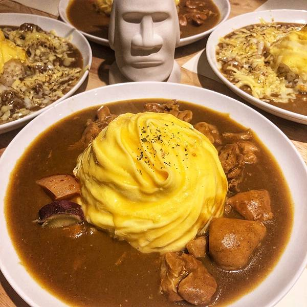

---

theme : "night"
transition: "slide"
highlightTheme: "monokai"
slideNumber: true
title: "Kotlin FP with Arrow"

---

### Kotlin FP
### with Arrow-kt.io

<style>
pre {
  background: #303030;
  padding: 10px 16px;
  border-radius: 0.3em;
  counter-reset: line;
}
pre code[class*="="] .line {
  display: block;
  line-height: 1.8rem;
  font-size: 1em;
}
pre code[class*="="] .line:before {
  counter-increment: line;
  content: counter(line);
  display: inline-block;
  border-right: 3px solid #6ce26c !important;
  padding: 0 .5em;
  margin-right: .5em;
  color: #afafaf !important;
  width: 24px;
  text-align: right;
}

.reveal .slides > section > section {
  text-align: center; 
}

h1,h2,h3,h4 {
  text-align: center;
}

p {
  text-align: center;
}
</style>

---

Jack Lo


---

### Outline

1. Functional Programming
2. Domain Modeling with ADT
3. Data Ops with @Optics
4. Error Handling with Either & Validated
5. Kotlin Coroutine & Parallelization
6. Resource Allocation & Releasing
7. Kotlin Flow
8. Algebras & Dependency Injection

--

- https://kotlinlang.org/docs/home.html
- https://arrow-kt.io/
- https://play.kotlinlang.org/

---

### 1. Functional Programming

--

- Pure Function
- Deterministic
- Referential Transparency

--

### Pure Function
#### ➡️ No *Side Effect*

--

### Side Effect

<font size="6">🔍 A side effect is when a function relies on, or modifies something *outside* its scope and parameters to do something.</font>

- DB Ops
- Logging
- System I/O

--

```Kotlin=
data class Record(val id: String, val cmmnt: String)
class RecordDB {
  fun save(record: Record): Unit { /*Insert or update the record to DB*/ }
}
val recordDB = RecordDB()

fun updateRecord(record: Record, cmmnt: String): Record {
  val updatedRecord = record.copy(cmmnt = cmmnt)
  recordDB.save(updatedRecord) // Side Effect!!
  return updatedRecord
}
```

--

### Deterministic
#### ➡️ Same input, same output

```Kotlin=
fun sum(num1: Int, num2: Int): Int = num1 + num2

fun main() {
  println(sum(1, 2)) // 3
  println(sum(1, 2)) // 3
  println(sum(1, 2)) // 3
  // ...
  // if inputs are 1 and 2, then the sum() always return 3
}
```

--

### Referential Transparency

<font size="6">🔍 An expression is called referentially transparent 

if it can be *replaced* with its corresponding value (and vice-versa)

*without* changing the program's behavior.</font>

--

- All functions in mathematics
- Substitution model - Reduce an expression to a value. ➡️ *λ−calculus*

--

### λ−calculus

<font size="6">🔍 A formal system in mathematical logic for expressing computation based on *function abstraction* and application using *variable binding and substitution*.</font>

```Kotlin=
// 1st simplification: rewritten in Anonymous Form

square_sum(x, y) = x^2 + y^2
=>
(x, y) -> x^2 + y^2

id(x) = x
=>
x -> x
```

--

```Kotlin=
// 2nd simplification:
// the lambda calculus only uses functions of a Single Input

square_sum(x, y) = x^2 + y^2
=>
(x, y) -> x^2 + y^2
=>
x -> (y -> x^2 + y^2) // identical to: x -> y -> x^2 + y^2 
// NOTE the last line
```

Doesn't it look familiar ... ?

--

### Curry !!

  

--

### Curry in Kotlin

```Kotlin=
val squareSum: (Int) -> ((Int) -> Int) = { x -> { y -> x*x + y*y }} 
// x -> (y -> x^2 + y^2)
val stillSquareSum: (Int) -> (Int) -> Int = { x -> { y -> x*x + y*y }} 
// x -> y -> x^2 + y^2

val squareSum5: (Int) -> Int = squareSum(5) 
// x = 5, thus return (y -> 5^2 + y^2)

fun main() {
  println(squareSum5(10))
  // y = 10, then get 5^2 + 10^2 = 125
}
```

--

### Referential Transparency

```Kotlin=
fun square(x: Int) = x * x
fun squareSum(x: Int, y: Int) = square(x) + square(y)

fun main() {
  println(squareSum(5, 10))
  // => square(5) + square(10)
  // => 5 * 5 + 10 * 10
  // => 25 + 100
  // => 125
}
```

We can do the substitutions only because the expressions are *equal* to their results.

--

- Functional Programming in Kotlin
- How Arrow-kt works?

--

### In Kotlin

Function is *first class citizen*

➡️ Functions can be treated like any other variable

<font size="6">🔍 We can pass them, return them, assign them, ...</font>

--

https://kotlinlang.org/docs/functions.html

- High Order Function
- Deferred Function
- Extension Function
- Infix Function
- Function Reference

--

### High Order Function #1

```Kotlin=
// Function is passed as an argument
fun opThenSum(x: Int, y: Int, op: (Int) -> Int): Int {
    val result = op(x) + op(y)
    return result
}

fun main() {
  println(opThenSum(5, 10, { it * it })) // 5*5 + 10*10 = 125
  println(opThenSum(5, 10) { it * it })  // 5*5 + 10*10 = 125
}
```

--

### High Order Function #2

```Kotlin=
// Function returns another function
fun sumOp(x: Int, y: Int): () -> Int {
    return { x + y }
}

fun main() {
  val sum = sumOp(5, 10) // sum is a function () -> Int
  println(sum()) // 5 + 10 = 15
}
```

--

### Deferred Function

```Kotlin=
fun sumOp(x: Int, y: Int): () -> Int = { x + y } 

fun main() {
  val sum = sumOp(5, 10) // sum is a function () -> Int

  println(sum()) // 15
  println(sum()) // 15
  println(sum()) // 15
}
```

--

### Extension Function #1

```Kotlin=
class NumOps {
    fun sum(x: Int, y: Int) = x + y
}
fun NumOps.square(x: Int) = x * x

fun main() {
  val ops = NumOps()
  println(ops.sum(5, 10)) // 15
  println(ops.square(5)) // 25
}
```

--

### Extension Function #2

```Kotlin=
fun ((Int) -> Int).add(y: Int) = { x: Int -> this(x) + y }

val square = { x: Int -> x * x }

fun main() {
  println(square(5)) // 25

  println(square.add(1)(5)) // 26
  // x = 5, this(x) = 25, y = 1
  // 25 + 1 = 26
}
```

--

### Infix Function

```Kotlin=
infix fun Int.add(y: Int) = this + y

fun main() {
  val x: Int = 5   
  
  println(x.add(10)) // 15
  println(x add 10)  // 15
}
```

--

### Function Reference

```Kotlin=
// Function is passed as an argument
fun opThenSum(x: Int, y: Int, op: (Int) -> Int): Int {
    val result = op(x) + op(y)
    return result
}

fun square(x: Int) = x * x

fun main() {
  println(opThenSum(5, 10, { it * it })) // 5*5 + 10*10 = 125
  println(opThenSum(5, 10) { it * it })  // 5*5 + 10*10 = 125
  
  println(opThenSum(5, 10, ::square))    // 5*5 + 10*10 = 125
}
```

---

### 2. Domain Modeling
### with ADT

---

### 3. Data Ops
### with @Optics

---

### 4. Error Handling
### with Either & Validated

---

### 5. Kotlin Coroutine
### &
### Parallelization

---

### 6. Resource
### Allocation & Releasing

---

### 7. Kotlin Flow

---

### 8. Algebras
### &
### Dependency Injection
